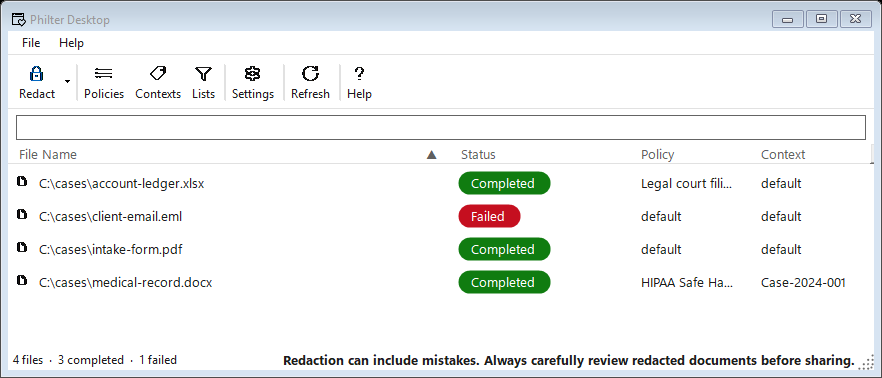

# Philter Desktop

A Windows desktop application for redacting personally identifiable information (PII) from PDF,
Microsoft Word (`.docx`), Excel (`.xlsx`), CSV, plain text (`.txt`), rich text (`.rtf`), and email
(`.eml`, `.msg`) files. Scanned, image-only PDFs are read with on-device OCR, so text baked into a
scan can be redacted too. Detection and redaction run on your own computer, and the app works with
no internet connection.




## Get Philter Desktop

Download Philter Desktop installer at
[https://philterd.ai/philter-desktop/download/](https://philterd.ai/philter-desktop/download/).

Personal and evaluation use is free. Commercial use is a per-user subscription (currently $100
per user, per year), which also covers direct support and official updates through your
subscription term. There are no license keys to enter.

The Philter Desktop source code is open source under the Apache License 2.0, so you (or your IT
department) can inspect exactly what it does, confirm it works entirely on your own machine and never
sends your documents anywhere.

## Documentation

The **[Philter Desktop user guide](https://philterd.github.io/PhilterDesktop/)** covers installing,
redacting each supported document type, policies, contexts, watched folders, and settings.

- **[Getting Started](https://philterd.github.io/PhilterDesktop/getting-started/)** — installing and
  redacting your first document.
- **[Building from Source](https://philterd.github.io/PhilterDesktop/building-from-source/)** —
  building, running, the test suite, and building the setup installer.

## Building from source

### Prerequisites

- .NET 10.0 SDK or later
- Windows 10/11
- Visual Studio 2022 (17.12 or later) — optional; the CLI is sufficient

The redaction engine ([Phileas](https://github.com/philterd/phileas-dotnet)) is consumed as the
`Philterd.Phileas` NuGet package, so no separate clone or build is required.

```bash
git clone https://github.com/philterd/PhilterDesktop
cd PhilterDesktop
dotnet build PhilterDesktop.slnx
```

For running, testing, the on-device model, and building the setup installer, see
[Building from Source](https://philterd.github.io/PhilterDesktop/building-from-source/).

## Features

- **Redaction queue** — add `.txt`/`.docx`/`.pdf` files (button or drag-and-drop); they are
  redacted in the background with live, color-coded status. PDF redaction is image-based (the
  output has no recoverable text layer).
- **Policy editor** — enable PII filters and configure their replacement strategies. Filters are
  discovered automatically from the Phileas model and grouped by category (Personal, Contact,
  Location, Financial, Identifiers, Technical, Medical, …), with a search box and an
  enabled-count indicator.
- **On-device name detection** — an optional **AI Detection → Names** filter uses a bundled
  [PhEye](https://github.com/philterd/phileas-net) GLiNER model to find person names contextually,
  running entirely on the machine with no network call. The model is downloaded at build time and
  shipped inside the installer (see [Bundled models](PhilterDesktop/Models/README.md)).
- **Highlight redactions** — optionally highlight the replacement text in redacted Word (`.docx`)
  documents for clearer visual review (a per-document option on the Redact Documents form).
- **Watched folders** — monitor folders for new `.txt`/`.docx`/`.pdf` files and redact them
  automatically to an output folder, each with its own policy, context, and highlight option
  (configured on the **Watched Folder** tab of Settings). Philter Desktop runs in the **system
  tray** (closing the window keeps it watching) and can **start at sign-in**.
- **Contexts** — manage redaction contexts for consistent replacement.
- **View Diff** — right-click a completed document → **View Diff…** to compare the original and the
  redacted output: a color-coded line diff for `.txt`, or a side-by-side page view for `.pdf`.
- **Passphrase protection** — optionally require a passphrase to open the encrypted database
  (**Settings → Security**); the key is re-wrapped, so toggling never re-encrypts the database.
- **Command-line redaction** — redact files headlessly for scripting/automation:
  `PhilterDesktop.exe /p mypolicy /c mycontext file1.pdf file2.pdf` (policy/context optional,
  defaulting to the default policy/context). Works even while the app is running.
- **Explorer right-click menu** — an optional **"Redact with Philter Desktop"** context-menu entry
  for `.pdf`/`.docx`/`.txt` files (toggled in Settings). Right-clicking files opens a dialog to pick
  the policy/context and adds them to the redaction queue; a multi-file selection opens one dialog.
- **Settings** — output location, logging, and the redaction policy defaults.

Each filter supports multiple replacement strategies:

- **Redaction** — replace with a format string (e.g., `{{{REDACTED-%t}}}`)
- **Static replacement** — replace with fixed text
- **Random replacement** — replace with a randomly generated value
- **Conditional filtering** — apply a strategy only when a condition is met
- **Scope control** — document-level or context-level replacement

## License

The source code is open source under the Apache License, Version 2.0. See [`LICENSE`](LICENSE).

The official Philter Desktop product - the signed, maintained build and the support that comes
with it - is a paid **per-user subscription** from Philterd, provided to subscribers under the
Philterd Commercial License Agreement (see [Get Philter Desktop](#get-philter-desktop) and
[philterd.ai](https://www.philterd.ai)). That agreement covers the official product and does not limit
your rights in the open-source code under the Apache license. ***Philter*** is a trademark of
Philterd, LLC; the Apache license does not grant permission to use that mark for redistributed builds.

Copyright 2026 Philterd, LLC.
