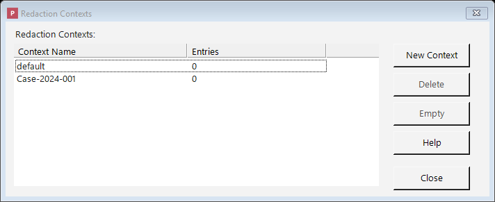

# Contexts (Keeping Replacements Consistent)

A **context** is the feature that keeps your replacements **consistent across a set of related
documents**. It's easiest to understand with an example.

Imagine you're redacting a stack of fifty documents in a single matter, and you've chosen to replace
real names with realistic stand-in names. Without a context, "Jane Doe" might become "Mary Smith" in
one document, "Susan Jones" in the next, and "Linda Brown" in a third — because each replacement is
generated separately. The documents would no longer line up with one another, and it would be
impossible to follow who's who.

A **context** fixes this. It acts like a shared memory: when you redact all fifty documents under the
same context, "Jane Doe" becomes the *same* stand-in name in **every** document. The set stays
internally consistent, the relationships between people are preserved, and the redacted documents
remain usable as a group.

A ready-made context named **default** is created for you automatically. You can create additional
contexts and choose which one to use when you add documents to the queue — for example, one context
per case or per matter, so that each matter's documents stay consistent within themselves but don't
get mixed up with another matter's.

## Managing your contexts

Open the **Contexts** window from the main toolbar. From there you can:

*The Contexts window: create per-case or per-matter contexts so related documents stay consistent.*

- **New Context** — create a new context (for instance, one for a new case).
- **Delete** — remove a context you no longer need.
- **Empty** — clear out the remembered replacements for a context **without** deleting the context
  itself. This is useful if you want to start the consistency "memory" fresh while keeping the context
  around.

## How contexts come into play

- When you add documents using the **Redact** button, you choose which context to use for them.
- Documents added by **drag-and-drop** use the **default** context.
- Whether replacements are actually shared from one document to the next depends on the
  [filter strategy](filter-strategies.md) you've chosen. Specifically, **random replacement** set to
  reuse values within a context is what makes the same original turn into the same stand-in
  everywhere. (If you're blacking information out entirely, consistency isn't a concern — every
  redaction just becomes the same placeholder anyway.)
