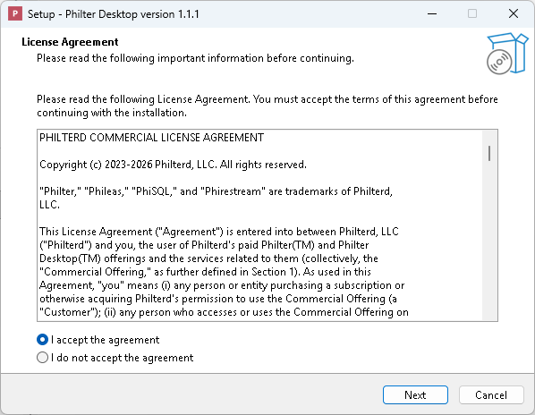
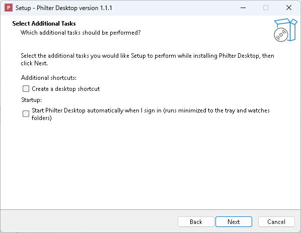
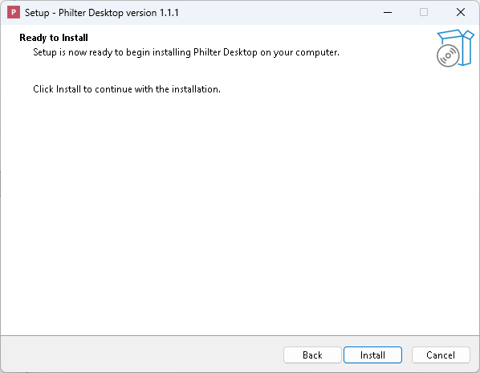
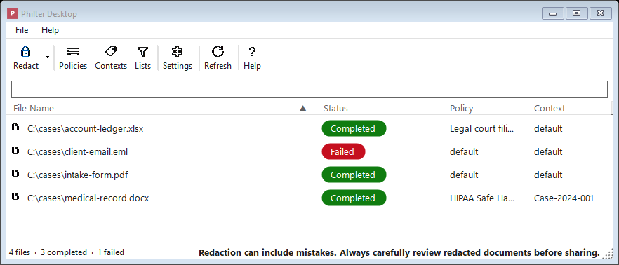

# Getting Started

This page covers installing [Philter Desktop](https://philterd.ai/philter-desktop/), redacting your first document, and
removing the program again.

## What you need

- A computer running **Windows 10 (version 1809 or later) or Windows 11**, 64-bit.
- **One installer covers every supported PC.** There is nothing to choose based on your hardware:
  the setup file contains the version built for **Intel/AMD (x64)** PCs *and* the version built for
  **Windows on ARM (ARM64)** PCs (such as Copilot+ PCs and Snapdragon-based laptops), and installs
  whichever one matches your PC. That is what lets on-device name detection run correctly on ARM PCs.

Philter Desktop's official, signed installer is **free to download** from
[philterd.ai](https://www.philterd.ai) and **free for personal use and evaluation**; using it for
commercial purposes requires a **per-user subscription that includes support** (see
[Licensing & Support](licensing.md)). There is no product key to type in, and every supported document
type (plain text, Microsoft Word, PDF, Rich Text, spreadsheets, and email) redacts out of the box. You
do **not** need administrator rights: Philter Desktop installs just for your own user account by
default.

## Installing Philter Desktop

Philter Desktop is delivered as a single **setup program**: one file you download and double-click.

To install:

1. **Download** the [Philter Desktop setup file](https://philterd.ai/philter-desktop). There is only
   one to choose from; it works on both Intel/AMD and ARM PCs. (The source is open on GitHub, so a
   technical user can also build their own copy; see [Licensing & Support](licensing.md).)
2. **Double-click** the downloaded file to start the setup wizard. It first asks whether to install
   **for me only** or **for all users**; choose **Install for me only**, which needs no administrator
   permission.
3. Read the **License Agreement**, choose **I accept the agreement**, and click **Next**.

    

    *The license agreement, shown before anything is installed. (Philter Desktop shows its licenses again the first time you open the program.)*

4. On the **Select Destination Location** page, click **Next** to accept the suggested folder. (There
   is no reason to change it unless you keep programs somewhere particular.)
5. On the **Select Additional Tasks** page, tick any optional extras you want and click **Next**. Both
   are off by default and both are safe to leave alone; the next section explains what they do.

    

    *The two optional extras: a desktop shortcut, and starting automatically when you sign in.*

6. On the **Ready to Install** page, click **Install**. This is your last chance to go **Back** and
   change an answer.

    

    *The final confirmation before the files are copied.*

7. When the files have been copied, the last page offers to **launch Philter Desktop** right away.
   Leave that ticked (or untick it) and click **Finish**.

Once it is done, Philter Desktop appears in your Start menu, and on your desktop if you chose that
option.

### The choices the setup wizard offers

The **Select Additional Tasks** page shown above offers a couple of optional checkboxes; you can leave
them at their defaults:

- **Create a desktop icon**: adds a Philter Desktop shortcut to your desktop. (Off by default.)
- **Start Philter Desktop automatically when I sign in**: has Philter Desktop launch quietly each
  time you sign in to Windows, running in the background so it can watch folders for you. Turn this on
  only if you plan to use the [watched folders](watched-folders.md) feature; otherwise leave it off.
  (Off by default. You can also change this later, from inside the program's Settings.)

By default the program installs **only for you** and does **not** require administrator permission. (If
you are setting up a shared computer and want it available to everyone, the wizard has an option to
install for all users, which does require an administrator.)

> **A note on Windows security warnings.** The **official signed installer** from
> [philterd.ai](https://www.philterd.ai) installs cleanly, with no warning. If you instead build
> Philter Desktop yourself from source, the resulting installer is unsigned, so Windows may show a
> blue **"Windows protected your PC"** message. This is a normal safety feature called SmartScreen
> that appears for software Windows hasn't seen signed by a known publisher. Click **More info** and
> then **Run anyway** to continue. If you have
> any doubt about where a file came from, stop and
> check with whoever provided it before going further.

### Installing without the wizard

If you would rather not click through the wizard, the setup file can install on its own. This is
useful when you are setting up several PCs, or installing from a script. Run the setup file from a
**Command Prompt** or **PowerShell** window with these options:

```
PhilterDesktop-Setup-<version>.exe /VERYSILENT /SUPPRESSMSGBOXES /CURRENTUSER
```

(Replace `<version>` with the version in the name of the file you downloaded, and include the folder
you saved it in.) The three options do this:

- **`/VERYSILENT`** installs with no wizard and no progress window at all.
- **`/SUPPRESSMSGBOXES`** answers any message the installer would show with its normal default, so
  nothing sits waiting for a click.
- **`/CURRENTUSER`** installs for your account only, which is what avoids the administrator prompt.

The installation itself is exactly the one the wizard performs with its default answers, including
picking the right version for your PC's processor. A few things follow from that, and are worth
knowing before you use it:

- **No desktop icon, and no starting at sign-in.** Both are off by default, and there is no wizard to
  turn them on. To include them anyway, add `/TASKS="desktopicon,autostart"`. You can also turn on
  start-at-sign-in later from inside the program's Settings.
- **Philter Desktop does not open when the install finishes.** Start it from the Start menu.
- **The license agreement is not shown, and this is not a way to accept it in advance.** The first
  time anyone opens Philter Desktop it still shows the license screen and the redaction notice, and
  they still have to be accepted before the main window appears. See *Your first time opening the
  program* below.

A few more options you can add if you need them:

- **`/DIR="C:\Some\Folder"`** installs somewhere other than the default location.
- **`/ALLUSERS`** installs for everyone who uses the PC instead of just you. Use this *instead of*
  `/CURRENTUSER`; it needs administrator rights, so run it from an elevated Command Prompt or
  PowerShell window (otherwise Windows shows a prompt, which defeats the point of installing
  silently).
- **`/LOG="C:\Some\Folder\install.log"`** writes a record of what the installer did, which is the
  first thing to look at if a silent install did not produce what you expected.

Installing a newer version silently works the same way: run the new setup file with the same options
and it replaces the old copy, keeping policies, contexts, settings, and history.

The uninstaller accepts `/VERYSILENT` too. Uninstalling this way never asks whether to remove your
saved data and **always keeps** your policies, contexts, settings, and history, so an unattended
uninstall cannot destroy them. To remove that data as well, uninstall normally and answer **Yes** to
the question (see
*[What uninstalling removes, and what it leaves behind](#what-uninstalling-removes-and-what-it-leaves-behind)*).

## Your first time opening the program

The very first time you run Philter Desktop, it shows two short screens you need to accept before the
main window opens:

1. A **license** screen showing the **Apache License 2.0** (the open-source code license) and the
   **Philterd Commercial License Agreement** (the license for the official build), each in its own
   panel. Read it and click **I Agree** to continue (or **I Disagree** to close the program).
2. A short **redaction notice** reminding you that automated redaction is not perfect and can miss
   things, so you should always review each cleaned-up document before sharing it. Click **OK** to
   acknowledge it.

Once you've accepted both, they won't appear again on future launches.

After that, you see the main window. The top of the window has a row of buttons
(a **toolbar**), and most of the window is taken up by the **redaction queue**, the list of
documents you've asked it to clean up. The first time you open the program, this list is empty.



*The main window: the toolbar along the top and the redaction queue filling the rest.*

The toolbar buttons are:

- **Redact**: add one or more documents to be redacted. Click the small **arrow** on this button for
  more ways to redact: **Redact with Preview…** (a live before-and-after preview before saving),
  **Find & Redact…** (remove specific words you type in), **Redact Spreadsheet…** (for `.xlsx` and
  `.csv` files), and **Redact Folder…** (redact every supported file in a folder).
- **Policies**: create and edit [policies](policies.md) (the rules for what gets removed).
- **Contexts**: manage [contexts](contexts.md) (consistent replacements).
- **Lists**: edit the global **Always Redact** and **Always Ignore** term lists that apply to
  **every** redaction, no matter which policy is used. (This is different from the per-policy lists
  inside the Policy Editor; see
  [Lists that apply to every policy](policies.md#lists-that-apply-to-every-policy-the-lists-button).)
- **Settings**: output location, logging, Word and PDF handling, watched folders, security, and
  notifications.
- **Refresh**: reload the queue (you can also press **F5**).
- **Help**: open this documentation.
- **Support**: a link (at the far right) to the Philter Desktop product page, where the official,
  signed build and the support subscription live (see [Licensing & Support](licensing.md)).

Philter Desktop already creates a starter **policy** named **default** (the set
of rules for what to remove) and a starter **context** named **default** (which keeps
replacements consistent). Because these are ready to go, **you can redact a document immediately**,
without setting anything up first.

## Redacting your first document

1. Click the **Redact** button on the toolbar (or simply **drag a document from a folder and drop it
   onto the window**).
2. Watch the document's row in the list. Its status moves from **Pending**
   (waiting its turn), to **Processing** (being worked on), to **Completed** (finished).
3. When it says **Completed**, your cleaned-up copy is ready. Open it by
   right-clicking the row and choosing **Open redacted file**, or find it in the folder where Philter
   Desktop saves its output (see [Settings](settings.md)).

The cleaned-up copy is a **brand-new file**. Your original document is left exactly as it
was. Always open the cleaned-up copy and read through it before you send it to anyone.

## Installing a newer version later

When a newer version of Philter Desktop comes out, you do not need to uninstall the old one first.
Download the new Philter Desktop setup file and run it the same way; it installs **over** your
existing copy, keeping all of your policies, contexts, settings, and history intact.

Philter Desktop can also tell you when an update is available: choose **Help → Check for Updates…**. If
a newer version exists, it lets you know and points you to your account page to download it. It never
downloads or installs anything on its own.

## Uninstalling Philter Desktop

Remove Philter Desktop the same way you would remove any Windows program:

1. Open the Windows **Settings** app and go to **Apps → Installed apps** (on Windows 10 this is
   **Apps & features**).
2. Find **Philter Desktop** in the list.
3. Click it (or the **⋯** menu next to it) and choose **Uninstall**, then confirm.

### What uninstalling removes, and what it leaves behind

When you uninstall, Philter Desktop automatically removes:

- the program itself and its Start-menu (and desktop) shortcuts;
- the **start-at-sign-in** entry, if you had it turned on; and
- the **"Redact with Philter Desktop"** right-click command, if you had turned that on in Settings.

**Your saved data is your choice.** Near the end, the uninstaller asks:

> *Also remove your saved Philter Desktop data for this account?*

This is your **policies, contexts, settings, and redaction history** (including any sensitive text the
history captured), kept in a private folder under your user account.

- **Choose No (the default)** to keep it, so a later reinstall still has everything. An upgrade keeps
  it too, and a silent or automated uninstall does not ask at all and always keeps it, so you never
  lose your setup by accident.
- **Choose Yes** to permanently delete that data for your account in one step. (You can also wipe just
  the history from inside the program with **File → Clear Redaction History…**, or delete the folder at
  `%LocalAppData%\PhilterDesktop\` by hand.)

**The cleaned-up files you already saved are never touched**, whichever choice you make: every redacted
copy stays where you saved it. Uninstalling never deletes your documents.

## Where to go from here

To fine-tune how Philter Desktop works:

- Learn how to control **what** gets removed and **how** it's replaced by creating and editing
  [policies](policies.md).
- Adjust [settings](settings.md) such as **where** your cleaned-up files are saved and what they're
  named.
- Set up [watched folders](watched-folders.md) so that documents dropped into a particular folder are
  cleaned up automatically.
