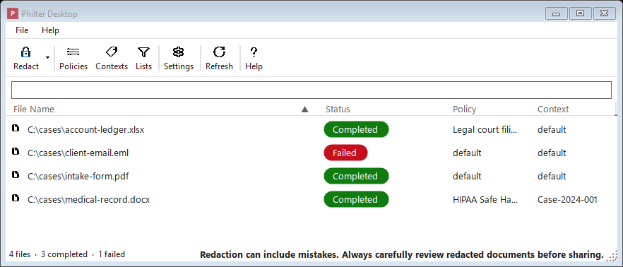
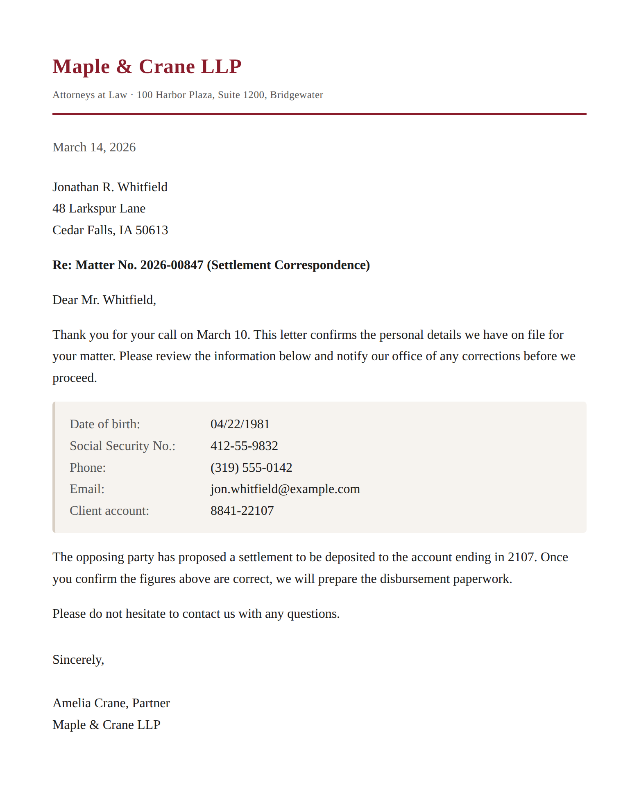
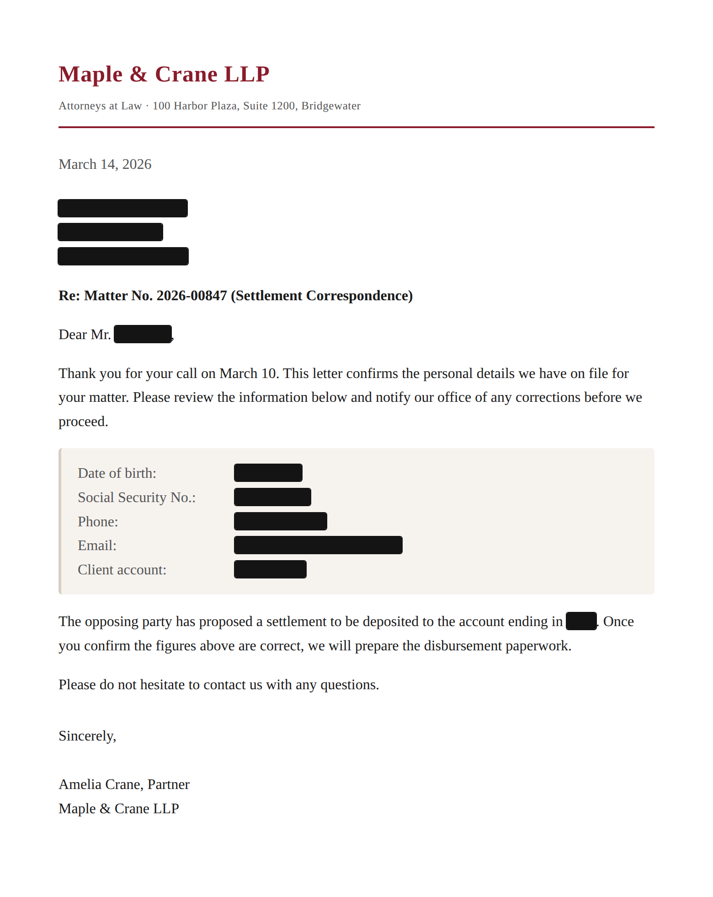

# Philter Desktop

**[Philter Desktop](https://philterd.ai/philter-desktop/)** is a Windows program that removes sensitive personal information from your
documents. You give it a file (a plain-text note, a Microsoft Word document, or a PDF) and
it produces a new, cleaned-up copy with things like names, Social Security numbers, phone numbers,
addresses, and account numbers blacked out or replaced. Your original file is never touched; Philter
Desktop always works on a separate copy.

*The main window: add documents and Philter Desktop redacts them in the background, showing each file's status.*

## A note on the word "redaction"

This guide uses the word **redaction** to mean **removing or hiding
sensitive information** so that a document can be shared more safely. When you redact a deposition
transcript, a medical record, a court filing, or a set of discovery documents, you take out the
pieces that should not be seen by the other side, the public, or anyone who doesn't need them, while
leaving the rest of the document intact and readable.

The sensitive pieces Philter Desktop looks for are often called **personally identifiable
information**, or **PII**: information that could
identify a specific person, such as a name, a date of birth, a home address, a Social Security number, a
driver's license number, a bank account, or a medical record number.

## What Philter Desktop does for you

- It reads **text files (`.txt`, `.rtf`)**, **Microsoft Word documents (`.docx`)**, **PDF files
  (`.pdf`)**, **spreadsheets (`.xlsx`, `.csv`)**, and **email (`.eml`, `.msg`)**.
- It finds a wide range of sensitive information automatically: names, email addresses, phone
  numbers, Social Security numbers, credit-card and bank-account numbers, street addresses, dates,
  and many more (the full list is on the [Supported Filters](supported-filters.md) page).
- It lets you decide **exactly what** to remove and **how** to replace it, for example blacking
  text out entirely, or swapping a real name for a stand-in label like `[NAME]`. These choices are
  saved in something we call a [policy](policies.md).
- It can keep replacements **consistent** across a stack of related documents, so that (for example)
  the same person is replaced with the same label everywhere they appear. This is handled by what we
  call a [context](contexts.md).
- It works quietly **in the background**, showing you the progress of each file as it goes.

## Who Philter Desktop is for

Philter Desktop is built for **one person, working on their own computer**. It is the right tool for
a paralegal, an attorney, a records clerk, an investigator, a researcher, or anyone else who
regularly needs to take sensitive details out of documents before sharing them, and who wants to
review the result themselves before it goes out the door.

Everything happens **on your own machine**. Your documents are not uploaded anywhere, not sent to a
website, and not shared with any outside service. This matters when you are handling
privileged, confidential, or regulated material, and it is a deliberate design choice.

## What Philter Desktop is **not**

- **It is not a team or case-management system.** There are no shared work queues, no assigning
  documents to colleagues, and no passing files back and forth for someone else to finish. Each
  person runs their own copy of Philter Desktop on their own documents.
- **It is not an approval or sign-off system.** Philter Desktop does not have built-in stages where
  a supervisor reviews and approves your work, and it does not keep a formal, court-ready audit trail
  of who did what. **You** are responsible for reviewing every redacted document before it leaves
  your hands. This is exactly why every cleaned-up file is named with the word **draft** by default
  (for example, `complaint_redacted-draft.pdf`): the program is reminding you that the file is a
  *first pass* that still needs your eyes on it.
- **It is not a website or an always-on server.** It is an ordinary desktop application that you open
  and use, like a word processor. It does not run a service that other programs or other people
  connect to.

## How it works, in three steps

1. **Add your documents.** Add files by clicking a button and choosing them, or by
   dragging them onto the window.
2. **Choose the rules.** Each document is handled according to a **policy** (which decides *what*
   sensitive information to look for and *how* to replace it) and a **context** (which keeps
   replacements consistent across related files). Defaults are set up for you, so you can
   start without configuring anything.
3. **Get your cleaned-up copies.** Philter Desktop creates a new copy of each document with the
   sensitive details removed, saves it to a location you choose, and leaves your original
   untouched. **Always open and review the cleaned-up copy before you share it.**

## What a redaction looks like

Here is the same document before and after Philter Desktop: the sensitive details are detected and
blacked out, while the rest of the document stays intact. (This example uses made-up data, not real
personal information, and detection is configurable. Always review the result against your own
documents.)

*Before: the original document.*

*After: the redacted copy.*

## Where to go next

- **[Getting Started](getting-started.md)**: how to install Philter Desktop and redact your very
  first document.
- **[Redacting Documents](redacting-documents.md)**: the day-to-day guide to adding files,
  reviewing the results, and adjusting what was removed.
- **[Policies](policies.md)**: how to set up the rules that decide what gets removed.
- **[Licensing & Support](licensing.md)**: the per-user subscription (includes support), and how the
  open-source code fits in.
