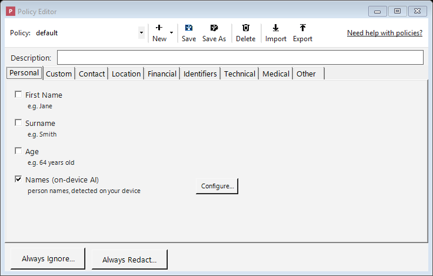
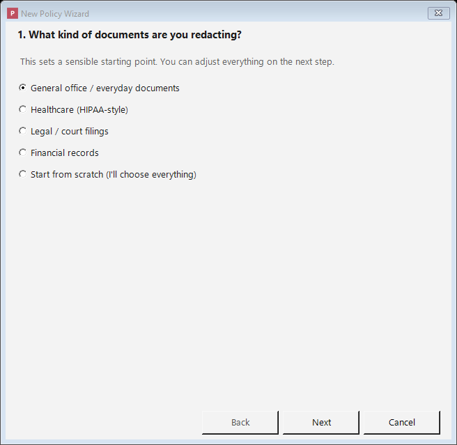

# Redaction Policies

A **policy** is a **saved set of rules** that tells Philter Desktop two things: *which kinds of
sensitive information to look for*, and *how to replace each kind* when it's found. Every document you
redact is handled according to the policy you've chosen for it.

You don't have to build a policy before you start: a ready-made policy named **default** is created
for you and works well for everyday redaction. As your needs become more specific, you can create your
own. For example, you might keep one policy for **court filings**, another for **medical records** in a
personal-injury matter, and another for **financial documents** in discovery, each tuned to remove
what that kind of document requires. You can create as many policies as you like.

To work with policies, click the **Policies** button on the main toolbar. This opens the **Policy
Editor**.

## A tour of the Policy Editor

The editor has a toolbar across the top and, below it, the kinds of information Philter
Desktop can detect, organized into **tabs** (one category per tab):

*The Policy Editor: turn on the kinds of information to remove, organized into category tabs.*

- **Policy selector**: a drop-down for choosing which policy to look at or change.
- **New / Save / Save As / Delete**: the buttons for managing your policies (covered below).
  **New** is a small menu: choose **Blank Policy** to start from scratch, **From Template…** to
  start from a ready-made policy, or **From Wizard…** to be guided through a few questions.
- **Import / Export**: **Export** saves the policy you're editing to a `.json` file (for backups
  or sharing with a colleague); **Import** loads a policy `.json` file back in as a new policy. Imported
  files are checked against the engine's policy schema first, so an invalid file cannot be brought in.
- **The detector tabs**: categories such as Personal, Contact, Location, Financial,
  Identifiers, Technical, Medical, and Other. Click a tab to see the kinds of information in that
  category you can remove. Selections on every tab are saved together as one policy; switching tabs
  doesn't lose anything.

(The word **filter** is another word for one of these detectors: "the email-address filter,"
"the Social Security number filter," and so on.)

## Turning on what you want removed

1. Find the kind of information you want to remove (for example **SSN** (Social Security number) or
   **Email Address**) and **check the box** next to it. That turns it on.
2. When you check a box, a **Configure…** button appears beside it. Clicking it lets you choose
   *how* that information is replaced (for example, blacked out entirely, or swapped for a stand-in
   label). Those choices are explained on the [Filter Strategies](filter-strategies.md) page.

You do **not** have to configure every detector. A detector that's turned on but not configured uses a
default: the detected text is replaced with a **marker that names what was removed**, like
`{{{REDACTED-SSN}}}` for a Social Security number. When you open **Configure…** for a detector you've
just turned on, this **default redaction is already listed**, so you can see what will happen and
change it if you like (for example, a blackout, a fixed label, or a shuffled stand-in). The quickest
way to build a policy is to check the boxes for everything you want removed and save.

For the complete list of what Philter Desktop can detect, see [Supported Filters](supported-filters.md).

## Starting from a template

To start from a ready-made policy rather than from scratch, click **New** and choose **From
Template…**. Philter Desktop offers a small set of starting points:

- **Common PII (recommended)**: the high-confidence everyday identifiers (Social Security numbers,
  email, phone, credit cards, dates such as dates of birth, and so on) plus on-device name detection.
  A safe general-purpose start. (This is also the **default** policy applied to new documents.)
- **HIPAA Safe Harbor (template)**: broad coverage aimed at the kinds of information called out by the
  HIPAA Safe Harbor standard (names, dates, locations, ages, and more). Deliberately thorough, so
  expect to review some over-redaction.
- **Legal court filing (template)**: the personal data commonly redacted in court filings (names,
  Social Security numbers, dates, and financial account numbers).
- **Financial records (template)**: financial and account data (names, Social Security numbers,
  credit cards, bank routing numbers, IBAN codes, and crypto addresses).

Pick one, give your new policy a name, and it's created ready to fine-tune like any other policy.

!!! warning "Templates are starting points, not compliance guarantees"
    A template's name (even one that mentions a law or standard such as "HIPAA Safe Harbor") is for
    reference only. It is **not** a certification that the policy, or its output, meets that
    requirement. Always review and adapt the policy to your situation, and **carefully check every
    redacted document**, before relying on it.

## Building a policy with the Wizard

Click **New** and choose **From Wizard…**. The wizard walks you through a few short questions and
builds a policy for you:

*The wizard builds a sensible policy for common document types in a few clicks.*

1. **What kind of documents are you redacting?** Pick a use case (general office, healthcare, legal,
   financial, or start from scratch). This sets a starting point; you can change everything next.
2. **What should be removed?** A checklist of the kinds of information, grouped into categories, with
   the ones from your chosen starting point already ticked. Add or remove whatever you like, including
   **people's names** (on-device AI).
3. **How should the removed information be replaced?** Choose a label (like `{{{REDACTED-SSN}}}`), a
   fixed word, or a consistent stand-in value.
4. **Name your policy.** Review a plain-language summary and give it a name.

When you finish, the wizard creates the policy ready to fine-tune like any other. The same warning
applies: a wizard-built policy is a **starting point, not a compliance guarantee**. Review it and
always check your redacted documents.

## Describing a policy

Just below the toolbar is a **Description** box. Use it to note what the policy is for, for example
*"Client intake forms: removes SSNs, dates of birth, and contact details."* The description helps you
and your colleagues recognize the policy later; it has **no effect on redaction**. It is saved with the
policy inside Philter Desktop, but is **not** included when you **Export** a policy to a file (the
exported file contains only the engine's policy definition).

## Saving your work

- **Save** updates the policy you're currently editing with your changes.
- **Save As** saves your current settings as a **new** policy under a new name, for basing a new
  policy on an existing one without changing the original.
- If you switch to a different policy, or close the editor, with unsaved changes, Philter Desktop
  asks whether to save first.

The **default** policy cannot be deleted, so you always have a working starting point.

## The "never redact" list (Always Ignore)

Sometimes Philter Desktop correctly detects something you'd rather **keep**. For example, your own
firm's name, a public office address, or a court's phone number might look like contact information
that would normally be removed, but you want it left in place.

Click the **Always Ignore…** button below the tabs and type those terms **one per line** (or click
**Import from file…** to load them from a `.txt` or single-column `.csv` file). Anything on this list
is left alone, even when a detector would otherwise have removed it.

Matching works on the **whole detected value** (a detected item that exactly equals one of your terms
is left untouched) and ignores capitalization unless you check **Match case**. The ignore list is
saved as part of **this policy**, so it applies only when you redact with this policy. To ignore a
term **no matter which policy you use**, use the global **Lists** button on the main toolbar instead;
see [Lists that apply to every policy](#lists-that-apply-to-every-policy-the-lists-button).

## The "always redact" list (Always Redact)

This is the mirror image of the ignore list. Sometimes a word or phrase should be **always removed**
even though it isn't a standard type of personal information Philter Desktop would recognize on its
own: for example, a confidential project codename, an internal matter number, or a name that is
sensitive in your case.

Click the **Always Redact…** button below the tabs and type those terms **one per line** (or click
**Import from file…** to load them from a `.txt` or single-column `.csv` file). Anything on this
list is removed wherever it appears.

Matching ignores capitalization. These terms are saved as part of **this policy** and apply only when
you redact with it. For a term you want removed in **every** policy, use the global **Lists** button on
the main toolbar instead; see below.

## Lists that apply to every policy (the Lists button)

The two lists above live **inside a single policy**; they only take effect when you redact with that
policy. For a rule that applies **no matter which policy is used**, use the **Lists** button on the
**main toolbar** (not in the Policy Editor).

It opens a window with two tabs, each a box where you type terms **one per line**:

- **Always Redact**: terms removed from **every** document you redact, with any policy.
- **Always Ignore**: terms **never** removed, with any policy.

You can type terms directly, or click **Import from file…** to load them from a `.txt` or single-column
`.csv` file (one term per line); imported terms are added to the current tab, skipping any already in
the list.

Click **OK** to save both lists (or **Cancel** to discard changes). These global lists are applied on
top of whatever policy is in use: the default policy, policies you create, watched folders, and the
command line all honor them.

### Policy lists vs. global lists: which should I use?

| | Where it lives | When it applies |
|---|---|---|
| **Policy Editor → Always Ignore / Always Redact** | Inside one policy | Only when you redact with **that** policy |
| **Lists button (main toolbar) → Always Ignore / Always Redact** | App-wide | **Every** redaction, with **any** policy |

Put case- or matter-specific terms in a **policy**; put terms that should always apply, like your own
firm's name (ignore) or a standing confidential codename (always redact), in the global **Lists**.

## Detecting names with on-device AI

On the **Personal** tab is an entry called **Names (on-device AI)**. Checking it turns on a
names-specific detector.

Why is this separate from the other detectors? Most sensitive information has a recognizable shape (a
Social Security number is always nine digits in a familiar pattern, an email address always has an
"@"), so a simple rule can spot it. **Names are different.** "April," "Hope," and "Mason" can be names
or ordinary words; whether something is a name depends on the surrounding sentence. Philter Desktop
uses **artificial intelligence**, a trained model that reads the context and decides what is a name,
more reliably than a fixed rule could.

For confidentiality, **this AI runs entirely on your own computer.** No part of your document is
uploaded or sent over the internet.

There's nothing to configure: check the box and save the policy. The first document you redact after
turning it on takes a moment longer while the model loads; after that it's quick.

!!! warning "If name detection is unavailable"
    If the names model is missing for any reason (an unusual or damaged installation, or antivirus
    quarantining it), Philter Desktop will **not** quietly pretend to redact names. It shows a yellow
    warning banner across the top of the main window and of every **Redact with Preview**
    window (and a message on the command line), telling you that **person names will not be redacted**
    by policies that look for them. Pattern-based detection (Social Security numbers, email, phone, and
    so on) still works. If you see this warning, **reinstall Philter Desktop** to restore name
    detection, and re-redact anything that was processed while it was unavailable.

## Redacting your own special identifiers (Custom Identifiers)

Beyond the built-in types, you can teach Philter Desktop to remove information that follows **your
organization's own format**: for instance, a case number like `CASE-2024-00123`, a client matter
ID, or an internal account number.

Enable **Custom Identifiers**, click **Configure…**, and describe the pattern you want to match, along
with a label for it. Patterns use a **regular expression**, a compact way of saying "match text that
looks like *this*" (for example, "the letters CASE, then a dash, then four digits, then a dash, then
five digits"). Regular expressions are a technical skill; if you're not comfortable writing one, ask a
technical colleague, or use the **Always Redact** list above for specific words and phrases, which
needs no special syntax.

Some example identifiers and the regular expressions that match them:

| Example identifier | Regular expression |
|--------------------|--------------------|
| Case number (`CASE-2024-00123`) | `\bCASE-\d{4}-\d{5}\b` |
| Medical record number (`MRN-1234567`) | `\bMRN-\d{7}\b` |
| Client matter ID (`12345-001`) | `\b\d{5}-\d{3}\b` |
| Internal account number (`ACCT-US123456`) | `\bACCT-[A-Z]{2}\d{6}\b` |
| Employee ID (`EMP000123`) | `\bEMP\d{6}\b` |
| Invoice number (`INV-2024-000123`) | `\bINV-\d{4}-\d{6}\b` |
| Insurance policy number (`POL-A1B2C3D4`) | `\bPOL-[A-Z0-9]{8}\b` |
| Patient ID (`PT-00123456`) | `\bPT-\d{8}\b` |
| Vehicle Identification Number (`1HGCM82633A004352`) | `\b[A-HJ-NPR-Z0-9]{17}\b` |
| Claim number (`CLM0123456789`) | `\bCLM\d{10}\b` |

Adjust these to match your organization's exact format. After redacting, use
[Verification](redacting-documents.md#checking-the-result-for-anything-missed-verification) to confirm
the pattern caught what you expected.
