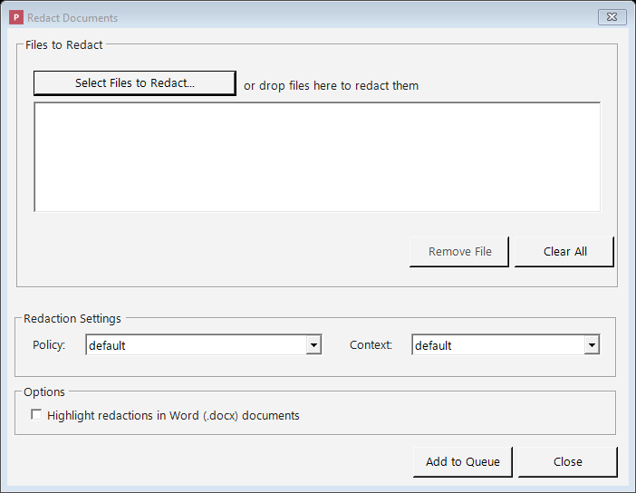

# Redacting Documents

This page explains how to add documents, how Philter Desktop redacts them, how to review exactly
what was removed, and how to adjust the result.

The **redaction queue** fills most of the main window. Every document you hand to
[Philter Desktop](https://philterd.ai/philter-desktop/) appears here as a row, along with its current
status, the policy (set of rules) being used, and the context (the consistency setting). Finished
documents stay in the list, so you can re-open, compare, or fine-tune them later.

## Which kinds of documents you can redact

Philter Desktop works with the document types below. Each has its own page covering how that type is
redacted and anything specific to it:

- **[Plain Text and Rich Text](redacting-text.md)**: `.txt` and `.rtf` files.
- **[Microsoft Word](redacting-word.md)**: `.docx` files.
- **[PDF](redacting-pdf.md)**: `.pdf` files, including scanned PDFs read with OCR.
- **[Spreadsheets](redacting-spreadsheets.md)**: Excel `.xlsx` and comma-separated `.csv` files.
- **[Email](redacting-email.md)**: `.eml` and `.msg` files.

The rest of this page describes the parts of redaction that are the **same for every document type**:
adding files, monitoring progress, previewing and adjusting the result, and checking what was
removed.

## Adding documents to the queue

There are two ways to add files:

- **The Redact button.** Click **Redact** on the toolbar. You choose which **policy** (rule set)
  and which **context** (consistency setting) to use, then select the files to add. Use this when you
  want specific rules for a batch of documents. The **Redact** button has a small **arrow** beside it;
  clicking it opens a menu with: **Redact with Preview…** (see the result before saving),
  **Find & Redact…** (remove specific words from one file), **Redact Spreadsheet…** (redact an
  `.xlsx`/`.csv` with optional whole-column removal, covered under
  [Spreadsheets](redacting-spreadsheets.md)), and **Redact Folder…** (add every supported file in a
  folder at once). These are described later on this page.
- **Drag and drop.** Drag one or more files from a Windows folder onto the Philter Desktop window.
  Files added this way use the **default** policy and the **default** context.

If a file is already waiting in the queue (or being redacted) with the same policy and context, adding
it again is skipped, so you won't get duplicate redactions of the same document. You can still redact a
file again after it finishes, or add it with a different policy or context.



*Adding files with the Redact button: pick a policy and a context, then add your documents.*

## What happens after you add a document

Philter Desktop redacts documents automatically in the background. Each row's **Status** column shows
where that document is in the process:

| Status | What it means |
|--------|---------------|
| **Pending** | The document is in line, waiting its turn. |
| **Processing** | The document is being redacted now. |
| **Completed** | The document was redacted successfully and the copy is ready. |
| **Failed** | Something prevented redaction: for example, the original file was moved or deleted, the file was open in another program, or the chosen policy no longer exists. |

A **Completed** status shown in **amber or red** means the document finished but its **Verification**
result needs review (for example, residual PII may remain, or names weren't checked because the name
model isn't installed). Hover the row for a short explanation, and check the **Verification** column.

If a document shows **Failed**, Philter Desktop records the reason. **Hover over the failed row** to
see it in a pop-up, or right-click the row and choose **View Details…**, where the reason appears as a
**"Why it failed"** line. The reasons are in plain language, for example: *"…could not save
'report.docx' because it is open in another program (such as Microsoft Word or a PDF viewer). Please
close it and try again."*

Once you've fixed the cause (closed the file, freed up disk space, raised a limit in Settings, and so
on), **retry** the document rather than adding it again:

- **Retry**: right-click the failed row and choose **Retry**. The document returns to **Pending**
  and is redacted again on the next pass.
- **Retry All Failed**: right-click anywhere in the queue and choose **Retry All Failed** to requeue
  *every* failed document at once. Useful when a single cause (such as a full disk) affected several
  documents together.

A document that failed for a permanent reason (such as an unsupported file type) will fail again with
the same explanation, so retrying it does no harm.

!!! note "After an unexpected shutdown"
    If Philter Desktop closes unexpectedly (a crash, or the computer shutting down) while a document is
    being redacted, that document could be left showing **Processing**. The next time you start
    Philter Desktop, it automatically moves any such interrupted document back to **Pending** so it is
    picked up and finished.

**Your original document is never changed.** Philter Desktop always writes the result to a **new,
separate copy**, named after the original plus a label. By default the label is `_redacted-draft`, so
`report.docx` becomes `report_redacted-draft.docx`, and it is saved to the location chosen in
[Settings](settings.md). The "draft" label is a reminder to review the file before relying on it.

For Word (`.docx`) files, the redacted copy also has hidden information (metadata, comments, tracked
changes, and hidden text) cleaned out by default; see [Microsoft Word](redacting-word.md).

## Redact a whole folder at once

To redact a folder of documents, click the small **arrow** beside the **Redact** button and choose
**Redact Folder…**.

In the dialog:

1. **Choose the folder** with **Browse…** (or type/paste its path).
2. Tick **Include files in subfolders** to also redact documents inside folders within it.
3. Pick the **policy** and the **context** to use for the whole batch.
4. Optionally tick **Highlight redactions in Word (.docx) documents**.

When you choose a folder, Philter Desktop scans it and reports what it found, for example: *"12 files
will be added to the redaction queue (5 .pdf, 4 .docx, 3 .txt)."* Click **Add to Queue** and every
supported file is added and redacted like any other document, with its own **Pending → Processing →
Completed** (or **Failed**) status. This is a one-time action: no watched folder is set up, and the
folder is not monitored afterward.

- **Only supported file types are picked up.** Files Philter Desktop can't redact (images, archives,
  and so on) are skipped, and the count reflects how many files will be processed.
- **Previous results are left alone.** Files whose name ends with your redacted-file label
  (`_redacted-draft` by default) are skipped, so running **Redact Folder…** again won't re-redact
  earlier drafts.
- **Per-file results are visible.** If one file can't be redacted (for example, a password-protected
  Word document), that row shows **Failed** with the reason; the rest of the batch still completes.
- **Your originals are never changed.** Each redacted copy is written to a new, separate file (see
  [What happens after you add a document](#what-happens-after-you-add-a-document) above).

## Redact with Preview: see the result before you commit

**Redact with Preview** lets you review the result and save it only once you're satisfied. It is best
for working on a single document at a time.

Start it from the **Redact** button on the toolbar: click the small **arrow** beside it and choose
**Redact with Preview…** (or right-click a document and choose the same). It works with `.txt`,
`.rtf`, `.docx`, `.pdf`, and email (`.eml` and `.msg`) files. (Spreadsheets, `.xlsx` and `.csv`,
don't have a preview yet; redact them the ordinary way and review the copy afterward.)
You pick the file, choose a **policy** and a **context**, and Philter Desktop shows **what the
redacted file will look like before anything is written to disk**:

- **Plain text (`.txt`) and rich text (`.rtf`)**: a live, side-by-side comparison of the original
  and the result, plus an editable list of every redaction. You can add, change, or remove
  individual redactions before saving. (Rich-text formatting is preserved in the saved file; the
  preview compares the visible text.)
    - **Redact something the detector missed by selecting it.** Switch to the **Select text to redact**
      tab, highlight the words to remove, and click **Redact selection**. The redaction is added
      to the list (marked **Added**), shows up in the before/after comparison, is applied when you
      save, and appears in the [redaction report](#generating-a-redaction-report-a-shareable-certificate)
      as a user-added redaction. You can remove it from the list like any other. (**Add…** also lets
      you enter a start and end offset by hand.)
- **Microsoft Word (`.docx`)**: a paragraph-by-paragraph comparison showing what will be removed,
  with an editable list of redactions and an optional **highlight** setting that marks the
  replacements for easy review. This preview shows the redacted **text**, not a full rendering of the
  finished Word page.
    - **Redact something the detector missed by selecting it.** Switch to the **Select text to redact**
      tab, highlight the words to remove, and click **Redact selection**. The redaction joins the
      list (marked **Added**), appears in the comparison and the [report](#generating-a-redaction-report-a-shareable-certificate)
      as a user-added redaction, and can be removed like any other. A selection that crosses
      paragraphs is split into one redaction per paragraph. (**Add…** also lets you type an exact
      paragraph and offset by hand.)
- **PDF (`.pdf`)**: the redacted PDF shown side by side with the original, with zoom controls and
  synchronized scrolling, plus an editable list of the redactions on each page.
    - **Redact a region the detector missed by drawing a box.** Turn on **Add Redaction (draw)** in the
      side panel, then drag a rectangle over the area to remove on the **original (left) page**.
      The box is added to the list (marked **Added**), the redacted side updates to show it, and it
      appears in the [report](#generating-a-redaction-report-a-shareable-certificate) as a user-added
      redaction; select it and click **Remove** to undo it. Because a redacted PDF is flattened to an
      image, the area you draw over is genuinely destroyed in the saved file, not merely hidden.
- **Email (`.eml` and `.msg`)**: a field-by-field comparison (subject, addresses, and body) showing
  what will be removed, with an editable list of redactions. Each redaction is anchored to a specific
  field; you can change its replacement or remove it. Outlook `.msg` files are saved as standard `.eml`.
    - **Redact something the detector missed in the body by selecting it.** Switch to the **Select text
      to redact** tab (which shows the message body), highlight the words to remove, and click
      **Redact selection**. It joins the list (marked **Added**) and the
      [report](#generating-a-redaction-report-a-shareable-certificate) as a user-added redaction, and
      can be removed again. Manual selection applies to **body** text; the subject and address headers
      aren't hand-edited (their detected matches are still removed automatically).

If you change the policy or context while previewing, Philter Desktop re-checks the document and
updates the preview. **Nothing is saved until you click "Save Redacted File"**, at which point you
choose where to put it. Once saved, the document is added to your queue (marked **Completed**), so you
can re-open, compare, or adjust it later like any other finished document.

The ordinary queue, the [watched folders](watched-folders.md) feature, and the command line
(described near the end of this page) are better choices when you need to redact **many documents at
once**.

## Find & Redact: remove specific words, no policy needed

**Find & Redact** strikes a few specific words or phrases (such as a name, a project codename, or a
client-requested phrase) out of one document, without a policy.

Open it from the **Redact** button's **arrow** menu on the toolbar and choose **Find & Redact…** (or
right-click a document in the queue and choose the same; if a document was already selected, its
path is filled in). In the window that opens:

1. Choose the **document** to redact (`.txt`, `.docx`, `.pdf`, `.rtf`, `.xlsx`, `.csv`, `.eml`, or `.msg`).
2. Type the **exact terms** to remove, **one per line**, or click **Import from file…** to load them
   from a `.txt` or single-column `.csv` file.
3. Click **Redact**.

Philter Desktop removes every occurrence of those terms (ignoring capitalization), saves a redacted
copy alongside the original, then offers to open the containing folder. It doesn't touch your policies,
queue, or history.

Use Find & Redact when you know **exactly** what text to remove. To have Philter Desktop *find*
sensitive information by its kind (every Social Security number, email address, or name), use a
[policy](policies.md) with the **Redact** or **Redact with Preview** actions above. For terms you want
removed in *every* redaction, use the global
[Lists](policies.md#lists-that-apply-to-every-policy-the-lists-button) instead.

## Working with the queue

Once a document shows **Completed**, you have several options:

- **Double-click** the row to open the redacted file.
- **Right-click** the row to:
    - **Open redacted file**: open the redacted copy.
    - **Open original file**: open the untouched original.
    - **Open containing folder**: show the redacted file selected in File Explorer.
    - **View Details…**: see a summary of the document: the original file name, the redacted file
      name, the policy and context used, how many redactions were made, when it was done, and how long
      redaction took ("Time to redact").
    - **View Diff…**: see a before-and-after comparison (explained below).
    - **Modify Redaction…**: review and adjust what was removed (explained below).
    - **Export Explanation (JSON)…**: save a detailed report of *why* each item was removed
      (explained below).
    - **Remove**, **Remove completed**, or **Remove all**: take items off the list.
    - **Retry** / **Retry All Failed**: requeue a failed document (or every failed document) after
      you've fixed the cause; see
      [What happens after you add a document](#what-happens-after-you-add-a-document), above.
      (**Retry** is available on a failed row; **Retry All Failed** whenever any row has failed.)
    - **Refresh**: reload the list.

The list updates as documents are processed, so you rarely need to refresh by hand. A **Refresh**
button is also on the toolbar (and **F5** refreshes too), useful when documents were added from the
[command line](#for-advanced-users-and-it-redacting-from-a-command-line) or the
[Explorer right-click menu](settings.md#explorer-right-click-menu) while Philter Desktop was open.

When you remove several items at once, Philter Desktop asks you to confirm first.

**Keyboard shortcuts:** **F5** refreshes the list, **Delete** removes the selected document, **Enter**
opens a completed document's redacted file, and **Ctrl+O** adds files.

### Finding a document in a long list

When you have many documents in the queue, two tools help you find the one you want:

- **Filter box.** Above the list is a box labelled *Filter by file name, status, policy, or
  context*. As you type, the list narrows to the documents that match: type part of a file name, or
  type `failed` to see only the documents that didn't finish. The status bar shows how many documents
  are shown (for example, *Showing 3 of 40 documents*). Clear the box (or press **Esc** while typing
  in it) to see the whole queue again.
- **Sorting.** Click any column heading (**File Name**, **Status**, **Policy**, **Context**, or
  **Verification**) to sort by that column. Click the same heading again to reverse the order. A small
  arrow shows which column is sorted and in which direction. (Sorting by **Status** groups the
  documents in order of work: pending, then processing, then completed, then failed.)

## Adjusting what was removed (Modify Redaction)

After a document is redacted, Philter Desktop **remembers the exact list of items it removed**, so you
can fine-tune that list without starting over. For example, you might *stop* hiding a name that's safe
to keep, or hide an extra item the detector didn't catch.

Right-click a **Completed** document and choose **Modify Redaction…**.

The window that opens shows two things:

- A **Versions** list. The first, automatic redaction is **Version 1**. Each version is a snapshot of
  a particular set of redaction choices.
- The **list of redactions** for the selected version. For each item you'll see its **Type**, the
  detector's **Confidence** in the match (as a percentage; blank for items you added by hand), the
  original **Text**, what it was **Replaced** with, the exact character positions it covers
  (**Start**/**Stop**), and the **Location** in the document. **Click any column heading to sort by it**
  — click again to reverse.

### How versions work

- **New Version** makes a fresh version by copying the most recent one, so you can experiment while
  your earlier work is preserved. (Creating a new version from Version 4 gives you a Version 5 that
  starts out identical to 4.)
- **Delete** removes the selected version, but **Version 1 can never be deleted**, because it
  preserves the original automatic result.
- Selecting a version shows its list of redactions, and any edits you make are saved to that version.

**Version 1 is read-only.** Because it's the permanent record of the original automatic redaction, you
cannot edit or delete its list. To make changes, click **New Version** first and edit that.

### Editing a version's list of redactions

To open a single redaction for editing, **double-click it** in the list. You can:

- **Remove** a redaction, for example to stop hiding a name that's safe to keep.
- **Edit** what a redaction is replaced with (and, for redactions you added yourself, where it sits
  in the document).
- **Add** a new redaction **by position**: tell Philter Desktop *where* in the document to redact,
  then give it the replacement text. What "position" means depends on the document type:
    - **Plain text (`.txt`) and Rich Text (`.rtf`)**: the starting and ending character positions.
    - **Microsoft Word (`.docx`)**: which paragraph, plus the start and end positions within that
      paragraph.
    - **PDF (`.pdf`)**: which page, plus a rectangle on the page.

!!! note "Spreadsheets and email: review and adjust, but no manual *Add*"
    For **spreadsheets (`.xlsx`, `.csv`)** and **email (`.eml`, `.msg`)**, each redaction belongs to a
    specific **cell** or **email field** rather than a position you can point to. You can still
    **review** the redactions, **remove** ones you'd rather keep, **change the replacement text**, and
    **Redact** to regenerate the file, but **Add** is turned off for these formats (there's no
    cell-by-cell "add here" to choose). If you need to remove the entire contents of a column in a
    spreadsheet, use **Redact Spreadsheet…** and tick that column instead. The location column shows
    which **Cell** or **Field** each redaction sits in.

### Seeing what was *not* redacted (low-confidence candidates)

The on-device AI ([name detection](policies.md#detecting-names-with-on-device-ai) and any custom local
models) scores every candidate it finds and only redacts the ones that clear its confidence threshold.
Sometimes it spots something that *looks* like a name but scores just below the line, so it's left in.
To review those near-misses, tick **Show low-confidence (not redacted)** below the list.

Philter Desktop re-scans your original document with the threshold lowered and adds the extra
candidates to the list, shown **greyed out** with **"(not redacted)"** in the Replacement column and
their (low) confidence score. These rows are **review-only** — they weren't redacted, so they can't be
edited or removed. If one *should* be hidden, either **Add** it as a redaction by hand, or raise your
policy's coverage (lower its threshold) and redact again.

A few things to know:

- It only surfaces candidates from the **on-device AI** detectors. Pattern-based filters (email, SSN,
  phone, and so on) use a fixed confidence, so they have nothing "just below the line" to show.
- It **re-runs detection**, so it takes a moment and needs the **original document** still in place. It's
  behind the toggle so opening the window stays fast; switching versions turns it back off.
- It looks a set amount **below each detector's own threshold**, so the list stays to plausible
  near-misses rather than noise. On a very busy document it shows the highest-confidence candidates and
  tells you the total.

Redactions are tracked **by their position in the document**, not by searching for their text. Every
redaction, whether Philter Desktop found it automatically or you added it by hand, is re-applied to
the exact spot it belongs, even if the same words appear elsewhere in the document.

When your list looks right, click **Redact** to produce the file from that version. Philter Desktop
re-applies that version's redactions to your **original document** and writes a fresh copy (Version 1
produces `report_redacted-draft.docx`, later versions add a number, like
`report_redacted-draft_2.docx`). Because the file is built from the original, **the original document
must still be in its original location.** The finished document opens automatically when ready.

Re-redacting produces a **new, unverified** output, so the document's earlier verification result is
cleared (its **Verification** status returns to not-checked). Run **Verify Redaction** again on the new
copy if you want it re-checked before sharing.

## Comparing the original and the cleaned-up copy (View Diff)

Before you rely on a redacted document, confirm what changed. Right-click a **Completed** item and
choose **View Diff…** (available for `.txt`, `.docx`, `.pdf`, `.csv`, and `.eml` files). This opens a
**before-and-after comparison**: the original on the **left** ("Before") and the redacted copy on the
**right** ("After"). The view is **read-only** and never changes either file.

> **Large files.** **View Diff is turned off for files over 10 MB** (the menu item is greyed out and
> labelled "file too large"). You can still open the original and redacted files directly to review
> them.

### Text, Word, CSV, and email documents (`.txt`, `.docx`, `.csv`, `.eml`)

A line-by-line comparison keeps matching lines side by side and color-codes the changes:

- **Red** marks text that was **removed**.
- **Green** marks text that was **added** (the replacements).
- **Yellow** marks lines that were **changed**.

Long lines wrap, and the two sides scroll together. For Word documents, the comparison looks at the
**text** Philter Desktop worked on — the paragraphs (body, headers and footers, footnotes, and
comments) and the text inside **shapes, SmartArt, and charts** — one line at a time, rather than the
page's fonts, spacing, or layout.

### PDF documents (`.pdf`)

The pages appear **side by side as images**: each page of the original next to the same page of the
redacted copy, so you can visually confirm every redaction. Use **Previous** and **Next** to move
through the pages, the **Fit**, **100%**, **+**, and **−** buttons to zoom, and (when zoomed in)
both sides scroll together. Because redacted PDFs are flattened to images, this is a visual
comparison rather than a word-by-word text comparison.

## Exporting an explanation of a redaction (JSON)

To show your work for a colleague, reviewer, audit, or your own records, export a detailed
**explanation** of a finished redaction. Right-click a **Completed** document and choose
**Export Explanation (JSON)…**.

This saves a `.json` file that lists, for **every item Philter Desktop removed**:

- **What** it was: the original text, and what it was replaced with.
- **Why** it was flagged: the detector that matched (for example, an email-address or Social Security
  number detector), the detector's confidence, and (for rule-based detectors) the pattern it
  matched and the surrounding words.
- **Where** it was: the position in the document (character position and paragraph for text and Word
  files; the page and location for PDFs).

A `.json` file is plain text that other programs can read. (Items you added by hand in **Modify
Redaction** are included too, marked as user-added.)

!!! danger "The explanation file contains the original sensitive text"
    Because the report lists the **original, un-redacted text** of everything that was found (along
    with the surrounding words), the explanation file is **just as sensitive as the original
    document**. Philter Desktop reminds you of this before it saves. Store it somewhere secure, treat
    it with the same care as the original, and **never** hand it out in place of the redacted copy.

## Checking the result for anything missed (Verification)

A **false negative** is sensitive text the policy missed that ends up in the redacted copy. To guard
against that, Philter Desktop can **verify its own work**: after redacting, it re-opens the
**finished output file** and runs the detector over it again, looking for anything that still matches.

This runs **automatically** after each redaction (you can turn it off in
[Settings → Security](settings.md)), and you can run it any time by right-clicking a **Completed**
document and choosing **Verify Redaction**.

- If nothing is found, the output **passed verification**.
- If something is found, it's surfaced **loudly**: a count of how many items may remain, plus a list
  showing each item's **type, the text still present, and where it is**. Fix it by adjusting the
  policy and redacting again, or by using **Modify Redaction**, before you share the file.

Verification looks for residual **detectable PII** in the text it can read back from the output; it is
not a check that every part of the document was preserved. For **rich text (`.rtf`)** in particular it
re-scans the **body** only, so a clean result does not by itself confirm that headers, footers, or
footnotes came through — when that applies, the result is flagged for review (see
[Rich Text](redacting-text.md#rich-text-rtf)).

### Two ways to scan: broad policy (default) vs. same policy

When you right-click a finished document, **Verify Redaction** offers two choices:

- **With broad policy** (recommended, and the default): re-scans with **every built-in detector turned
  on**. This is the check that matters most: it can surface kinds of information your policy never
  looked for (for example, a phone number when your policy only removed email addresses). Because it
  looks for everything, it may also flag things you **chose not to redact**, so treat its findings as
  prompts to review, not as mistakes. The document's own replacement values (such as realistic stand-in
  names) are **not** reported.
- **With same policy**: re-scans using only the **same policy that redacted the document**. This merely
  confirms that policy *took effect*; it **cannot** find a kind of information the policy never looked
  for, so it is a limited check.

The automatic check after each redaction uses whichever of these you select in
[Settings → Security](settings.md). It uses the **broad policy by default**.

### Seeing a document's verification result later

Each document's most recent result is shown in the **Verification** column of the queue (**Clean**,
**N may remain** in red, **Names not checked** in amber, **Check failed**, or **Not checked**), so you
can see at a glance which finished documents need attention. **Names not checked** means the document
was redacted but on-device name detection wasn't available (the model isn't installed), so person names
may remain — review it. The same result, with the time it was checked, also appears in **View Details**
(right-click a document). Running **Verify Redaction** again refreshes it.

Verification reads the **written output**, not an in-memory copy, so it also catches any problem in how
a particular format was saved. Like everything else in Philter Desktop, it runs **entirely on your
device**: nothing is sent anywhere. The result is included in the redaction report below.

!!! note "Verification is a safety net, not a guarantee"
    A "passed" result means no built-in detector found anything remaining (aside from the document's own
    replacements). It can't prove a document is free of every possible identifier. Always give an
    important document a human review as well.

## Generating a redaction report (a shareable certificate)

To **prove what was done** for a case file, a client, or a compliance record, generate a **redaction
report**. Right-click a **Completed** document and choose **Generate Report…**.

Philter Desktop first asks whether to include a **detailed per-redaction table**, then saves the
report as a **PDF** and opens it. The report summarizes the redaction:

- The **source and redacted file names**, and a **SHA-256 fingerprint** of each file (so the report is
  tied to exactly those documents and any later change is detectable).
- The **policy** and **context** used, the **Philter Desktop version**, and the **date and time**.
- A **count of what was removed, by type** (for example, *7 Email Address, 3 Ssn*) and the total.
- The **verification result** (when verification has run): whether the output passed, or how many items
  may remain.
- If you chose the detailed table: a row per redaction with its **type, location, and replacement**.

The report is saved as a new file next to your other output; your original and redacted files are not
touched.

!!! tip "The report is safe to share: it contains no original text"
    Unlike the explanation file below, a redaction report **never includes the original, un-redacted
    text** (not even in the detailed table, which shows only the type, location, and replacement). That
    makes the report safe to file alongside, or hand out with, the redacted copy. When you need the
    actual detected text for your own secure records, use **Export Explanation (JSON)** instead.

## For advanced users and IT: redacting from a command line

> **This section is optional and aimed at technical users.** Everything Philter Desktop does is
> available through the normal window; this option exists mainly so an IT department can automate
> redaction.

Philter Desktop can redact files without opening its window, which is useful for automation. Run it
from a command prompt (Command Prompt or PowerShell) and pass one or more files, optionally naming a
policy and context:

```
PhilterDesktop.exe /p mypolicy /c mycontext file1.pdf file2.pdf file3.pdf
```

- **`/p`** or **`--policy`**: the name of the policy (rule set) to use. Optional; if you leave it
  off, the **default** policy is used.
- **`/c`** or **`--context`**: the name of the context (consistency setting) to use. Optional; if
  you leave it off, the **default** context is used.
- **`--highlight`**: highlight the replacements in redacted **Word (`.docx`)** documents so they are
  easy to spot during review (the same option offered for [watched folders](watched-folders.md) and in
  the main window). Optional and off by default; it has no effect on other file types.
- **`/h`** or **`--help`**: show a short usage reminder.

Each file is redacted into a copy with the usual `_redacted-draft` label (saved according to your
output-location [setting](settings.md)); originals are never changed. The supported types are `.txt`,
`.docx`, `.pdf`, `.rtf`, `.xlsx`, `.csv`, `.eml`, and `.msg` (an `.msg` is redacted to an `.eml`; see
[Email](redacting-email.md)). On finishing, it reports a result code: **0** means everything
succeeded, **1** means at least one file failed, and **2** means the command was typed incorrectly or
an unknown policy was named.

> Run it from a terminal window to see the result for each file. This mode never opens the main
> window and works even when Philter Desktop is already open, which makes it suitable for the Windows
> Explorer right-click menu described below.

To redact from a Windows folder without the command line, turn on the
[Explorer right-click menu](settings.md#explorer-right-click-menu) in Settings. You can then
right-click files in any folder, and Philter Desktop opens a dialog where you choose the policy and
context and add the files to the queue.

## A reminder about what gets removed

What Philter Desktop looks for, and how it replaces what it finds, is decided by the **policy**
assigned to each document. To change what's removed or how it's replaced, see [Policies](policies.md)
and [Filter Strategies](filter-strategies.md).
