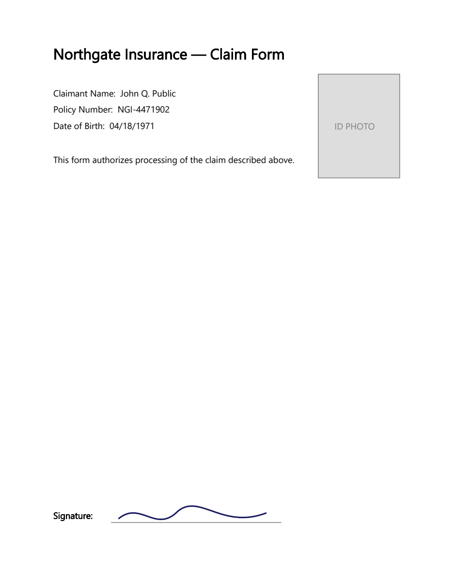

# PDF

Philter Desktop redacts PDF files that end in **`.pdf`**.

## How PDF redaction works

When Philter Desktop redacts a PDF, it turns each page into a flattened **picture** of the page with
the sensitive information painted over. The removed information is *truly gone*: there is no hidden text
layer left behind that someone could copy, search, or recover, unlike "redacted" PDFs whose black boxes
can be copied off to reveal the text underneath. The trade-off is that the cleaned-up PDF behaves like a
scanned document: you can read it and print it, but you can no longer select or search its text.

Because each item is simply painted over with a solid box, your
[filter strategy](filter-strategies.md) choice (the replacement text) does **not** change how a
redacted PDF looks: PDFs always get solid boxes.

## Scanned PDFs

Some PDFs are just *pictures* of pages (for example, a document that was scanned), with no real text
inside for Philter Desktop to detect. When the **Read scanned PDF pages with OCR** option is on (it is
by default), it recognizes the text on scanned pages **on your own computer** (nothing is uploaded) so
the sensitive information can be found and removed. OCR is slower and is best-effort: it can miss low-quality scans
and does not read handwriting, so reviewing the result matters even more here, and the
[Modify Redaction](redacting-documents.md#adjusting-what-was-removed-modify-redaction) tools let you
cover anything it missed. You can turn this off or fine-tune it on the
[Settings → PDF](settings.md#pdf-tab) tab.

## Text only — images are not detected

Philter Desktop finds and removes **text** — including the text OCR recognizes on scanned pages — but it
does not analyze pictures. **Faces, signatures, ID photos, logos, stamps, and other non-text images are
not detected and will remain in the redacted PDF.** If a document contains visual information that must
be removed — for example, a photograph or signature on a scanned ID — review the redacted file and cover
those areas yourself. When the sensitive area is always in the **same place** (as on a form or a
standard ID), a **PDF region** can black it out automatically; see below.

## Always blacking out a fixed area (PDF regions)

Sometimes the same spot on every page should always be covered — a signature block, a photo on an ID
form, a letterhead logo, or a stamp — whether or not it contains text Philter Desktop can read. A
**PDF region** is a rectangle that is always painted over when a PDF is redacted with that policy.

PDF regions are part of a **policy**. In the [Policy Editor](policies.md), click **PDF Regions…** to open
the region list, then add regions in whichever way is easier:

- **Draw on PDF…** — the recommended way. Choose a representative PDF, then drag a rectangle over each
  area to cover. Every rectangle you draw stays outlined on the page, and you can move through the pages
  to mark areas on each. Drew one in the wrong spot? **Right-click it and choose Remove Region.** When
  you click **Done**, the regions you drew are added to the list.
- **Add Region…** — type a region's position and size directly (in PDF points, 1/72 inch, measured from
  the bottom-left of the page). Useful for fine-tuning or when you already know the exact coordinates.

Each region has:

- **Pages** — which pages the region covers. Enter a single page (`3`), a **range** (`2-5`), a **list**
  (`1,2,5`, and mixes like `2-5,8`), or **0** for **every page** (handy for a footer, letterhead, or
  margin that repeats). A range or list stays a **single row** showing the pages as you entered them;
  when the policy is saved it's applied to each of those pages. Anything else is rejected with a message
  so a typo can't silently do nothing.
- **X**, **Y**, **Width**, **Height** — the rectangle, in PDF points from the bottom-left of the page.
- **Color** — the fill color, chosen from a short list (**Black**, White, Red, Yellow, Blue, Green,
  Gray). It defaults to **black**.

In the region list you can **double-click** a region to edit it, or **right-click** any row for a menu
with **Add Region…**, **Modify Region…**, **Duplicate**, and **Remove**. **Add Region…** is always
available; **Modify Region…**, **Duplicate**, and **Remove** apply to the selected region (so they're
enabled only when one is selected). **Duplicate** makes a copy of the selected region as a new one —
handy for placing several similar boxes. Click **OK** to save the regions into the policy (they are
stored with it, like the rest of the policy).

Because regions live in the policy, they apply to **every** PDF you redact with that policy — ideal for a
fixed form or ID layout. To cover a one-off area on a single document instead, use **Add Redaction
(draw)** while [previewing that PDF](redacting-documents.md#adjusting-what-was-removed-modify-redaction).
A region is painted as a solid box like any other redaction, so the covered content is truly gone, not
just hidden.

### Example: a form with a photo and a signature

Many documents put sensitive, **non-text** content in the same place every time. The example form below
has an **ID photo** (top-right) and a **handwritten signature** (bottom). Neither is text, so OCR and
detection can't find them — but both sit at fixed positions, which is exactly what a PDF region is for.

[Download this example form](examples/claim-form-example.pdf) and try it:

1. Open (or create) a policy in the Policy Editor and click **PDF Regions… → Draw on PDF…**.
2. Choose the downloaded `claim-form-example.pdf`.
3. Drag a rectangle over the **ID PHOTO** box, and another over the **signature** — each stays outlined
   so you can see what you've marked (right-click a rectangle to remove it).
4. Click **Done**, then **OK** to save the regions into the policy.
5. Redact the form with that policy. The photo and signature are painted over, along with the text the
   policy detects (the name, policy number, and date of birth).

Because the regions are stored in the policy, **every** form with the same layout is covered the same
way — you don't redraw them each time. For a form that spans several pages, enter a page range or list
(or `0` for all pages) so one region covers each page at once.

For adding files to the queue, previewing, adjusting, verifying, and reporting on a redaction, see
[Redacting Documents](redacting-documents.md).
