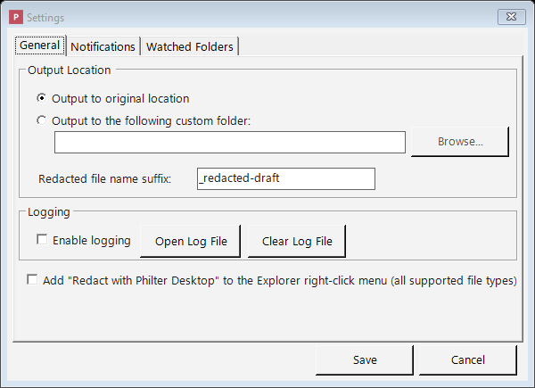

# Settings

Open **Settings** from the main toolbar to control where your cleaned-up files are saved and how the
program behaves. The Settings window is divided into tabs: **General**, **Microsoft Office**, **PDF**,
**Email**, **Notifications**, **Watched Folder**, **Limits**, and **Security**.

*The Settings window, where you choose the output location and tune how Philter Desktop behaves.*

## General tab

The **General** tab is where you set the output location (where cleaned-up files go), turn logging on
or off, switch on the Windows Explorer right-click menu, and choose whether Philter Desktop starts
automatically when you sign in to Windows.

## Where your cleaned-up files are saved (Output location)

You choose where Philter Desktop puts the cleaned-up copies it creates:

- **Original location**: the cleaned-up copy is saved in the **same folder** as the document it came
  from.
- **Custom folder**: every cleaned-up copy is saved into **one folder that you pick**, no matter
  where the original came from.

Either way, the cleaned-up file is always a **new copy**: your original document is never changed.

**Duplicate file names are never overwritten.** If a cleaned-up copy would have the same name as a file
already in the output folder — for example, two documents called `invoice.pdf` from different folders,
both sent to one custom output folder — Philter Desktop adds a number so nothing is clobbered:
`invoice_redacted-draft.pdf`, then `invoice_redacted-draft (2).pdf`, then `(3)`, and so on. (This also
means redacting the same document again produces a new numbered copy rather than replacing the previous
one.) When you use **Redact with Preview** and save with the **Save** dialog, Windows asks before
overwriting instead.

You can also set the **Redacted file name suffix**, the label that's added to the end of each
cleaned-up file's name (just before the file extension). By default it is **`_redacted-draft`**, so
`report.docx` becomes `report_redacted-draft.docx`.

The default says "draft" because **automatic redaction can miss things**: the file still needs **your
review** before you share it and should never be assumed safe just because the computer produced it.
Change the suffix to match your own naming habits. (If you clear the box and leave it empty, it resets
to the default.)

## Logging

Turning on **logging** tells Philter Desktop to keep a running record of what it does in a log file,
useful if something goes wrong and you (or technical support) need to look into it. The **Open Log
File** button shows you the log. Logging is **off** by default.

Use **Clear Log File** to permanently delete that log. The log records application activity for
troubleshooting (errors and the names of files that were processed); it does **not** contain the
detected or redacted text from your documents. Since the file names themselves can be sensitive, you
can wipe it whenever you like. A new log starts the next time something is logged.

Once the log reaches about 5 MB it's rolled over to a backup (a few older backups are kept and the
oldest is discarded), so it never fills up your disk.

## Explorer right-click menu

This option lets you redact files **straight from a Windows folder**, without opening Philter Desktop
first.

Turn on **Add "Redact with Philter Desktop" to the Explorer right-click menu**. Once it's on, you can
go to any folder, select one or more `.pdf`, `.docx`, `.txt`, `.rtf`, `.xlsx`, `.csv`, `.eml`, or
`.msg` files, **right-click** them, and choose **Redact with Philter Desktop**. A small window appears listing the files you picked and
letting you choose the **policy** and **context** to use (and whether to highlight redactions in Word
documents). When you click **Redact**, the files are handed to Philter Desktop's
[redaction queue](redacting-documents.md) and processed just like any other document. Philter Desktop
starts up on its own if it isn't already running. If you select several files at once, you get a single
window for the whole group.

A few practical notes:

- Switching this option **on** adds the right-click command for your user account; switching it
  **off** removes it again. The change happens **immediately**; there's no need to click a separate
  Save button.
- Uninstalling Philter Desktop always cleans up the right-click command for you.
- The option is **off** by default.
- If you're a technical user who'd rather automate redaction without the pop-up window, you can use
  the [command line](redacting-documents.md#for-advanced-users-and-it-redacting-from-a-command-line)
  directly.

## Start automatically at sign-in

Turn on **Start Philter Desktop at sign-in** to have Philter Desktop launch on its own each time you
sign in to Windows. It starts **minimized to the system tray** (the small icons near the clock) and
keeps working quietly in the background, which is what makes [watched folders](watched-folders.md)
useful even when you haven't opened the window yourself. Leave it **off** if you'd rather start the
program by hand. This setting is saved with the others when you click **Save**.

## Microsoft Office tab

Office documents carry information that has nothing to do with the visible text, and a "redacted" file
that still includes it defeats the purpose. The **Microsoft Office** tab lets you strip these hidden
channels and control header/footer redaction. All options below are **on by default**:

- **Remove document metadata (author, company, title, keywords, custom fields).** Clears the document's
  properties so the redacted copy doesn't name who wrote it or where it came from. For Word, this also
  **anonymizes the reviewer names on any comments you keep** — each author becomes a neutral label such
  as "Reviewer 1" (kept consistent so a back-and-forth still reads as separate people) — and removes the
  stored list of reviewer identities. **Applies to both Word (`.docx`) and Excel (`.xlsx`).**
- **Remove reviewer comments.** Deletes all comments (and the reviewer names attached to them). When
  this is **off**, comments are kept but their text is still redacted, and their author names are
  anonymized if **Remove document metadata** is on (above). *(Word only.)*
- **Accept and remove tracked changes (revisions).** Accepts every insertion and deletion and removes
  the revision history, so no record of who changed what (or what the earlier text was) remains.
  *(Word only.)*
- **Remove hidden text.** Deletes text that was marked hidden, which wouldn't show on screen but is
  still present in the file. *(Word only.)*
- **Redact text in page headers and footers.** Scans the running header and footer — the lines that
  repeat at the top and bottom of every page (for example "Confidential — John Doe") — and redacts
  detected sensitive information there, just like the body. **Only text is redacted**: images, logos,
  page numbers, and other non-text content in a header or footer are left as they are. Legitimate text
  such as a printed date is only removed if your policy targets it. Turn this off if a header/footer
  contains text you don't want scanned. **Applies to both Word (`.docx`) and Excel (`.xlsx`).**
- **Redact charts.** Scans embedded charts and redacts detected sensitive information in their **titles
  and labels** and in the **cached data values** — the copy of the plotted series and category values
  a chart keeps inside the file, which would otherwise remain even after the source cells are redacted.
  Redacting a cached value can change how a chart looks (a label or bar may show the replacement text),
  so **review charts in the redacted copy**. Charts are only scanned as text through your policy, so a
  sensitive value a chart is built from is removed only when the policy detects it. **Applies to both
  Word (`.docx`) and Excel (`.xlsx`).**
- **Redact cached formula values** *(Excel only)*. An Excel formula keeps a **copy of its last computed
  result** inside the file. That copy can duplicate sensitive information from a cell you're redacting
  (for example a formula `=A2` that pointed at a redacted address), and it stays in the file as plain
  text until Excel recalculates. When on, a formula whose cached result holds detected sensitive
  information becomes a **static redacted value**, and the remaining formula caches are **cleared** with
  the workbook set to recalculate when it's next opened in Excel. One side effect: a program that reads
  the file **without recalculating** (i.e. not Excel) sees empty formula results until it recalculates —
  turn this off if that matters for how the file is consumed, and be aware a formula's cached copy of a
  redacted value may then remain. Verification checks formula caches either way.
- **Redact pivot table cache** *(Excel only)*. A pivot table keeps a **denormalized copy of its source
  data** inside the file — the pivot cache — so redacting the sheet cells alone leaves an intact copy of
  the sensitive values. When on, the cached values in the pivot cache (its definition and records) and in
  the pivot table are scanned and redacted, and the cache is set to **refresh from the (redacted) source
  when the file is opened** in Excel. On by default. Redacting the cache changes what the pivot shows
  until Excel refreshes it. Verification checks the pivot cache either way.
- **Remove embedded objects Philter Desktop can't inspect** *(Word and Excel)*. A document can **embed
  another file** (Insert → Object) — an Excel workbook, a Word document, or a legacy/other-program object.
  An embedded **Word or Excel** document is **redacted in place** (its own content is scanned like any
  other document); but an object Philter Desktop **can't read** — a legacy OLE object or another
  program's file — can't be inspected, and would otherwise ship with its original content. When on, those
  un-inspectable objects are **removed**. On by default. When off, they are kept and **verification warns**
  that their content wasn't inspected — so you can review them yourself.

Leave these on unless you have a specific reason to keep that information. They affect only what's
stored in the redacted copy; your original document is never changed, and you should still review the
finished file.

## PDF tab

Some PDFs are **scanned**: each page is a *picture* of a document rather than real, selectable text.
Such a file has no text for Philter Desktop to read, so on its own it would have nothing to detect and
redact. The **PDF** tab controls whether Philter Desktop uses **OCR** (optical character recognition)
to read those scanned pages.

- **Read scanned (image-only) PDF pages with on-device OCR** (on by default). When on, Philter Desktop
  recognizes the text on scanned pages **entirely on your own computer** (nothing is uploaded), so the
  PII on them can be found and redacted like any other document. Pages that already contain real text
  are read normally; OCR is used only where it's needed. A page that has *both* real text and a large
  scanned image (for example, a scan beneath a typed letterhead) is read both ways, so nothing slips
  through.

OCR is **best-effort**: it is slower than reading normal text, and it can miss low-quality scans,
unusual fonts, and **handwriting**. As always, review the redacted file before sharing it, and the
[Modify Redaction](redacting-documents.md#adjusting-what-was-removed-modify-redaction) tools let you
cover anything OCR didn't catch.

### Advanced settings

The **Advanced…** button (available when OCR is on) exposes two thresholds that decide *when* a page is
read with OCR. **Most people should never change these.** The defaults suit virtually all documents, and
the wrong value can make redaction slower or cause pages to be read the wrong way. Change them only if
you have a specific problem and understand the trade-off.

- **Treat a page as scanned when its text covers under … %** (default **1%**). If the real text on a
  page fills less than this share of the page, the page is treated as scanned and read with OCR. Raise
  it to OCR more pages (slower, but less likely to miss a mostly-scanned page); lower it to OCR fewer.
- **Also OCR a text page when images cover at least … %** (default **50%**). Even when a page has real
  text, if pictures cover at least this share of it, Philter Desktop also OCRs the page to catch any
  text inside those pictures. Lower it to OCR more pages that contain large images.
- **Maximum pages to OCR in one PDF** (default **200**). A safety limit: if a single PDF needs OCR on
  more pages than this, Philter Desktop **stops with an error** instead of partly processing it, so a
  document is never saved looking finished while sensitive text on the un-OCR'd pages survives. Raise it
  to handle larger scanned documents, or set it to **0** for no limit.

To return to normal behavior, set these back to **1%**, **50%**, and **200**.

- **Redact recurring images (experimental)** (off by default). When on, redacting a PDF also blacks out
  **images that repeat across its pages** — the hallmark of a logo, watermark, or stamp — wherever they
  appear, without drawing a fixed region. It is **experimental**: it only covers **raster (picture)
  images** (not logos drawn as vector lines), may **miss** some or **cover more than intended** (any image
  that legitimately repeats is redacted too), and it leaves full-page backgrounds alone so it doesn't
  black out whole pages. **Review the redacted PDF** when this is on. See
  [Redacting PDF documents](redacting-pdf.md#automatically-covering-recurring-images-experimental).

## Email tab

A redacted email keeps more than the message you can see. Email files carry **technical headers** that
can identify the sender and how the message travelled: the **originating IP address**, the **mail
program** that sent it, and the **server-by-server delivery trail** (the `Received`, `X-…`, and `ARC-…`
headers, `Message-ID`, and similar). A "redacted" email that still includes these can leak who sent it
and from where.

- **Remove technical email headers from redacted email** (on by default). When on, those identifying
  headers are stripped from the redacted `.eml`. The visible fields (**Subject, From, To, Cc, the body,
  and the Date**) are kept (and their PII is still redacted as usual); only the hidden routing/technical
  headers are removed. (The send **Date** can be removed separately with the option below.)
- **Remove Bcc and other identity headers (Reply-To, Sender, Resent)** (on by default). These headers
  carry recipient or sender addresses that **aren't** part of the visible **From / To / Cc** fields, so
  they wouldn't otherwise be redacted. **Bcc** is the most important: it names blind-copy recipients and
  is carried over when an Outlook `.msg` is converted, so without this it would survive into the
  redacted email. When on, these headers are **removed entirely** (not just scanned): both their value
  and the fact that they were present are gone. Turn it off only if you specifically need to keep them —
  and be aware that **when it is off, these headers are kept exactly as they are**. Unlike **From / To /
  Cc**, they are **not** scanned for PII, so any addresses in them — **including Bcc recipients** — remain
  in the redacted email. If you disable this, review those headers yourself before sharing.
- **Remove the Date header from redacted email** (**off** by default). When on, the **Date** header
  (the message's send time) is **dropped outright**, so the send time is removed no matter how it is
  formatted — this does not rely on the policy recognizing a date. It is off by default because the send
  date is usually wanted and isn't personally identifying on its own; turn it on if your policy needs to
  remove temporal identifiers. (A timestamp can also appear inside the delivery trail — leave the
  technical-header option above on to strip that.)
- **Remove attachments from redacted email** (**off** by default). When on, every attachment is
  **deleted entirely from the redacted email — not redacted**. Philter Desktop does not open, inspect, or
  redact attachment content in any case; this option removes the attached files outright, including their
  **filenames** (which can themselves reveal information, e.g. `john_smith_ssn.pdf`). It is off by default
  because it discards content you may need; turn it on when an email's attachments could carry sensitive
  information that must not ship in the redacted copy. The message body is still redacted as usual.
    - **Also remove inline images** (**off** by default; available only when the option above is on).
      **Inline images** are pictures embedded in the message body — logos, signatures, pasted screenshots
      — referenced by the HTML with a `cid:` link. Philter Desktop **does not inspect or redact image
      content**, so sensitive information shown only inside an image would otherwise pass through. When on,
      inline images are **deleted** and their references in the body are neutralized. Leave it off if you
      want to keep images such as a corporate logo — but note the caveat below. **Whenever a redacted
      email still contains attachments or inline images, verification adds a warning** that their content
      wasn't inspected, so an un-inspected image is never left silently.

Leave the first two on unless you specifically need to preserve the original headers (for example, for
an e-discovery chain-of-custody requirement).

## Notifications tab

The **Notifications** tab controls the small pop-up messages (sometimes called "balloon" or "toast"
notifications) that appear near the Windows clock when a document finishes redacting.

- **Show a tray notification when a document finishes redacting**: turn this on or off. It is **on by
  default**. Click **Save** to apply your choice.

A few things worth knowing about these notifications:

- They appear **only when you're not already looking at Philter Desktop**: when its window is hidden
  in the system tray or minimized. While the window is open in front of you, Philter Desktop never
  interrupts you with a pop-up, because you can already see the results in the queue.
- When several documents finish at once (for example, files dropped into a
  [watched folder](watched-folders.md)), they're combined into a **single** notification rather than
  one per file.
- **Clicking the notification** opens the folder containing the finished files.
- Turning this option **off** stops these pop-ups entirely. It does not affect anything else: your
  documents are still redacted, and the [queue](redacting-documents.md) still shows each document's
  status.

This setting is the **master switch** for all completion notifications. [Watched
folders](watched-folders.md) have their *own* per-folder notification checkbox, but that only has an
effect while this master switch is on: if you turn notifications off here, no pop-ups appear for
watched folders either, regardless of each folder's setting.

## Watched Folder tab

The **Watched Folder** tab lets you set up folders that Philter Desktop **watches automatically**:
any document dropped into a watched folder is redacted on its own, without you adding it to the queue
by hand. So that watching keeps working even when the window is closed, the program can run quietly
from the system tray; to have it available automatically, turn on **Start Philter Desktop at sign-in**
on the [General tab](#start-automatically-at-sign-in). This feature has its own detailed page; see
[Watched Folders](watched-folders.md).

It also has a **"Watched-folder files to redact at once"** setting. Leave this at **1** (the default)
unless you have a specific reason to change it: redacting several files at once uses more memory and
processor, so a higher number should be chosen only with careful consideration. See [Processing more
than one file at a time](watched-folders.md#processing-more-than-one-file-at-a-time) for guidance.

## Limits tab

The **Limits** tab holds safeguards that keep very large or unusual inputs from using up all of your
computer's memory.

- **Skip input files larger than … MB** (default **500**). Redacting a file loads it into memory, so an
  extremely large file can be slow or fail. **Any** file larger than this is not redacted, however it was
  added: on the **automatic** paths (watched folders and the command line) it is **skipped** and noted in
  the log, and a file you add yourself (drag-and-drop, **Add Files**, or **Redact Spreadsheet**) is marked
  **failed** in the queue with a note — rather than being loaded whole and risking running your computer
  out of memory. Set it to **0** for no limit. Separately, when you add files yourself, Philter Desktop
  also shows a proceed/cancel heads-up above **50 MB** for large (but still under-the-limit) files, since
  those can be slow.
- **Maximum time for one detection pattern (seconds)** (default **5**, adjustable from **5 to 15**).
  Detection patterns can come from a [policy](policies.md), including your own
  [custom-identifier](policies.md#redacting-your-own-special-identifiers-custom-identifiers) regular
  expressions, which may also arrive in a policy someone shared with you. A badly written or overly
  complex pattern can take an extremely long time on certain text, which would otherwise make redaction
  appear to hang. This limit aborts any single pattern that runs longer than the chosen number of
  seconds: that document reports an error (so you know to fix the pattern) instead of freezing. The
  default of 5 seconds is far more than a normal pattern ever needs; raise it only if a genuinely huge
  document needs more time.

## Security tab: protecting your stored information

This tab controls how the information Philter Desktop stores on your computer is kept safe.

### What Philter Desktop stores, and why it's protected

To do its job, Philter Desktop keeps some information on your computer: your policies, your contexts,
your settings, the list of documents in your queue, and the **redaction history** (the record of what
was redacted, which, through the [Modify Redaction](redacting-documents.md#adjusting-what-was-removed-modify-redaction)
feature, can include the actual sensitive text that was found). All of this lives in a small private
file in your personal Windows profile.

Because that history can contain personal information, Philter Desktop **encrypts the file at rest** so
it can't be read by anyone who simply opens it: it's stored in a locked, unreadable form whenever it's
sitting on your disk. The "key" that unlocks it is created automatically the first time you run the
program and is locked to **your Windows account on that specific computer**, using a protection feature
built into Windows itself. By default you don't have to enter any password, but the file can only be
opened by **you, signed in to your own account, on your own machine**; a copy taken to another computer
would be useless. If you're upgrading from an older version, your existing data is locked down
automatically the first time the new version runs.

> This protects your data from someone reading it off the disk directly, or from a stolen copy of the
> file. It does **not** protect against other software that's already running under your own Windows
> account; for that, use the passphrase option described next.

### Adding a passphrase for stronger protection

By default, your stored information is tied to your Windows account. For an extra layer of protection
(one that even other software running as *you* can't get past), the **Security** tab lets you require a
**passphrase** (a password) before the program will open:

- Check **Require a passphrase to open the database** and choose a passphrase (at least 8 characters,
  typed twice to confirm). From then on, Philter Desktop will ask you for it every time it starts.
- Use **Change Passphrase…** to change it later (you'll confirm the current one first).
- Uncheck the box to remove passphrase protection and go back to the standard Windows-account
  protection.

**The passphrase itself is never saved anywhere.** The program only keeps enough scrambled information
to *check* that what you type is correct; it never stores the passphrase in a form anyone could read.
Turning the passphrase on or off, or changing it, takes effect **instantly** and never requires
re-processing your data.

> **Please choose your passphrase carefully and store it somewhere safe.** If you forget it, **there
> is no way to recover your stored information.** Also note that, because the program must be unlocked
> before it can do anything, you'll be asked for the passphrase even when Philter Desktop starts
> automatically at sign-in (which keeps your watched folders working).

### Verifying redactions automatically

The **Verify each redaction by re-scanning the output for PII that may remain** option (on by default)
makes Philter Desktop double-check its own work: after each document is redacted, it re-opens the
finished file and runs the detector again, looking for anything the policy might have missed. If
something is found, you're warned and shown what and where. It runs entirely on your device. This
applies to **every** way Philter Desktop redacts — the queue, [watched folders](watched-folders.md)
(the warning appears in the folder's activity log and notification), and the command line (it's printed
as a warning) — so an automated redaction is never silently left unchecked.

Two scan choices sit underneath it (they apply to the automatic check):

- **Scan with a broad policy — every detector on** (default, recommended): looks for kinds of
  information your policy didn't cover (the missed-PII case that matters most). It catches more, so it
  may flag things you deliberately left unredacted (review those); the document's own replacement
  values aren't reported.
- **Scan with the same policy used to redact** (limited): only confirms that policy took effect — it
  can't find a kind of information the policy never looked for.

Leave verification on, or turn it off if you prefer to verify manually. You can always right-click a
finished document and choose **Verify Redaction**, which lets you pick **With
same policy** or **With broad policy** for that one document. See
[Checking the result for anything missed](redacting-documents.md#checking-the-result-for-anything-missed-verification)
for details.

### Clearing your saved redaction history

If you want to wipe the stored history of what's been redacted, use **File → Clear Redaction History…**
from the main window. This erases the saved versions and redaction lists (including any sensitive text
they captured) and **removes the completed documents from the queue list**. It does **not**
delete the cleaned-up files you've already saved to disk; those remain wherever you saved them, and any
documents still being processed are left in place.
