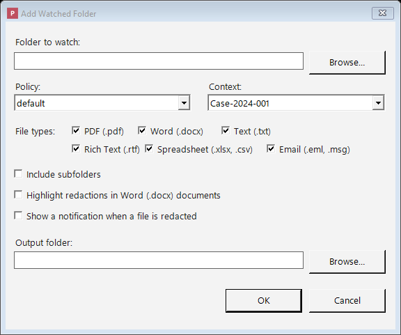

# Watched Folders

A **watched folder** is a folder that Philter Desktop keeps an eye on for you. Whenever a new
`.txt`, `.docx`, `.pdf`, `.rtf`, `.xlsx`, `.csv`, `.eml`, or `.msg` file shows up in that folder, Philter Desktop notices it,
redacts it automatically, and saves the cleaned-up copy to an output folder you've chosen — all without
you having to add anything to the queue by hand. (As elsewhere, a redacted `.msg` is saved as an
`.eml` — see [Email](redacting-email.md).)

This turns redaction into a "drop box" that runs itself. For example, you could point a watched folder
at the place where your scanner saves documents, at your Downloads folder, or at a shared network
folder where colleagues drop files — and from then on, **everything that lands there gets cleaned up
automatically**. It's ideal for a steady stream of documents that all need the same treatment.

## Creating a watched folder

Open **Settings** from the main toolbar, go to the **Watched Folder** tab, and click **Add…**. You'll
be asked to fill in a few things:

*Creating a watched folder: choose the folder, its policy and context, which file types to redact, and where the cleaned-up copies go.*

- **Folder to watch** — the folder you want Philter Desktop to monitor for new files.
- **Policy** — the [policy](policies.md) (set of rules) that decides what to remove and how, for
  files in this folder.
- **Context** — the [context](contexts.md) (consistency setting) to use for these files.
- **File types** — which of **PDF (.pdf)**, **Word (.docx)**, **Text (.txt)**, **Rich Text (.rtf)**,
  **Spreadsheet (.xlsx, .csv)**, and **Email (.eml, .msg)** you want redacted in this folder. You must
  pick at least one; any other kinds of files in the folder are simply ignored. (Redacted emails are
  written as `.eml`, so an `.msg` dropped here becomes a redacted `.eml` in the output folder.
  Spreadsheets dropped here are redacted cell-by-cell with detection only — to remove whole columns,
  use **Redact Spreadsheet…** in the main window instead.)
- **Highlight redactions in Word (.docx) documents** — when checked, the replacements in cleaned-up
  Word documents are highlighted, making them easy to spot when you review the file.
- **Show a notification when a file is redacted** — when checked, a small pop-up appears near the
  clock as files in this folder are cleaned up (several at once are combined into one summary, and
  failures are reported too). Clicking the pop-up opens the output folder. These pop-ups are held back
  while the main Philter Desktop window is open and in front of you, so they don't get in your way.
  Because this is set per folder, you can keep a busy folder quiet while still being notified about
  others. (Note: notifications also have a master on/off switch on the
  [Notifications tab](settings.md#notifications-tab) in Settings — if you turn notifications off
  there, this per-folder checkbox has no effect.)
- **Include subfolders** — when checked, files inside folders *within* the watched folder are
  monitored too, and the cleaned-up output mirrors that folder structure (so two files with the same
  name in different subfolders don't overwrite each other). If you turn this on, the output folder
  must be **outside** the watched folder. Hidden and system files and folders are skipped, and
  **folders that are shortcuts to another location** (junctions or symbolic links) are **not followed**,
  so watching can never reach outside the folder you chose. (If you want another folder watched, add it
  as its own watched folder.)
- **Output folder** — where the cleaned-up copies are saved. This must be a **different** folder from
  the one being watched (otherwise the cleaned-up files would themselves look like new files to
  redact).

Each watched folder has its **own** policy, context, highlight setting, and output folder. That means
you can watch several folders at once, each with completely different rules — for instance, one folder
for medical records and another for financial documents, each handled its own way.

To change a watched folder's settings later, select it and click **Edit…**. To stop watching a folder,
select it and click **Remove**. Any changes you make to the watched-folder list take effect right
away.

## How the automatic redaction works

A few details worth knowing about how watching works:

- **Which files are handled:** only `.txt`, `.docx`, `.pdf`, `.rtf`, `.xlsx`, `.csv`, `.eml`, and
  `.msg` files are redacted; everything else in the folder is left alone. (A redacted `.msg` is saved
  as an `.eml`.)
- **What the copies are named:** cleaned-up copies are saved to the output folder with the usual
  label (by default `_redacted-draft`, so `invoice.pdf` becomes `invoice_redacted-draft.pdf`). Your
  originals are never changed.
- **Files already in the folder:** when Philter Desktop starts up, it also picks up files that were
  *already* sitting in a watched folder — not just files added afterward.
- **No redacting the same file twice:** the cleaned-up output files are themselves ignored, so they're
  never redacted again, and a file that's already been redacted is skipped unless it changes.
- **Large or still-arriving files:** if a file is still being copied or downloaded, Philter Desktop
  waits until it has fully finished arriving before redacting it, so it never works on a half-written
  file.
- **One at a time, by default:** watched files are redacted **one at a time**. This keeps memory use
  low and predictable — only a single document is ever loaded at once — so even a folder full of large
  files can't overwhelm your computer. (See the setting below if you want to change this.)

## Processing more than one file at a time

By default Philter Desktop redacts watched-folder files **one at a time**. On the **Watched Folders**
tab in [Settings](settings.md), the option **"Watched-folder files to redact at once"** lets you raise
this to up to **4**. If you routinely drop in **lots of small files** (say, exported records), allowing
2–4 at once can finish the batch noticeably faster.

Two things make this safe to raise:

- **Big files still run alone.** Any file over 50 MB is always redacted by itself, never alongside
  others, so a large, memory-heavy document can never pile on top of other work.
- It only affects **watched folders** — the main window's queue and one-off redactions are unchanged.

!!! warning "Change this setting only with careful consideration"
    Leave this at **1** unless you have a specific reason to change it. Running several redactions at
    once uses **more memory and more processor** — each file in progress is held in memory while it's
    cleaned — and if a policy uses on-device **name detection**, that work is demanding too. On a
    modest machine, or with larger documents, a higher number can make the whole computer feel slow or,
    in extreme cases, run out of memory. Raise it gradually (try **2** first), watch how your machine
    copes, and lower it again if anything struggles. When in doubt, **1** is the safe choice.

## The activity log

Every watched folder keeps its own **activity log** so you can see exactly what's been happening and
confirm nothing was missed. On the **Watched Folder** tab, select a folder and click **View Log…**.
With timestamps, the log shows:

- when a file was **found**,
- when it was **redacted**, and **where** the cleaned-up copy was saved,
- when a file was **skipped** (because it had already been redacted), and
- any **errors** (shown in red).

The log window has a **Refresh** button to load the latest activity and a **Clear Log** button to
empty it. Entries stay until you clear the log or remove the folder, and anything older than **30
days** is removed automatically to keep the log tidy.

## Working quietly in the background (the system tray)

So that it can keep watching your folders without a window cluttering your screen, Philter Desktop can
tuck itself away into the **Windows system tray** — the row of small icons near the clock:

- **Closing the window** (clicking the **X**) does **not** quit the program; it just hides it to the
  tray, and watching keeps running. The first time this happens, a pop-up explains it so you're not
  caught off guard.
- **Double-click the tray icon** to bring the main window back.
- **Right-click the tray icon** for a short menu:
    - **Open Philter Desktop** — reopen the window.
    - **Pause watching / Resume watching** — temporarily stop or restart automatic monitoring.
    - **Exit** — fully close the program and stop watching.

If you choose **Exit** while documents are still being redacted or waiting in the queue, Philter
Desktop warns you first and lets you stay open so that work can finish — that way you don't
accidentally stop a redaction partway through. (Closing the window with the **X** is always safe: it
only hides to the tray, and any in-progress redactions keep running.)

As long as Philter Desktop is running — even when it's only sitting in the tray — all of your watched
folders are being monitored.

## Starting automatically when you sign in

To have Philter Desktop watch your folders even after a restart, turn on **Start Philter Desktop at
sign-in** on the **General** tab of Settings — a simple on/off checkbox. After that, it launches on
its own whenever you sign in to Windows and picks up watching right where it left off.

## Things to keep in mind

- Watching only happens while **you are signed in** to Windows. For unattended, always-on redaction on
  a server (running even when nobody is logged in), you would need a Windows service, which Philter
  Desktop does not currently provide.
- The output folder must always be different from the folder being watched.
- Just like [PDFs you redact by hand](redacting-documents.md), redacted PDFs from a watched folder are
  flattened to images, so the removed text is truly gone and cannot be recovered.
